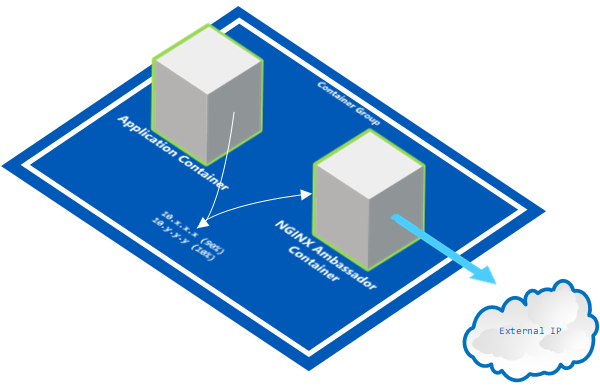
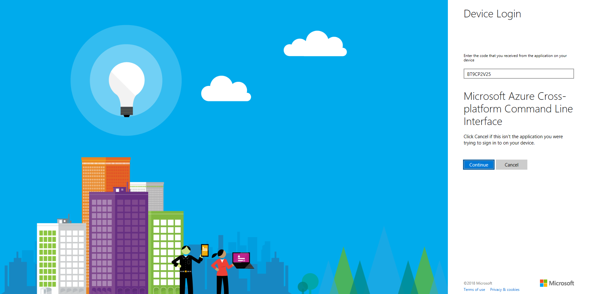
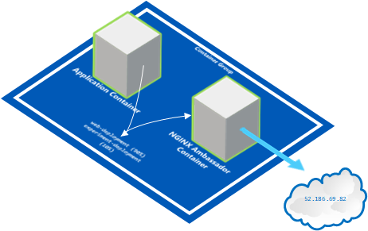

# Single Node Pattern: Ambassador #
## Deploying a request splitting ambassador with NGINX and Kubernetes on AKS ##

In this lab we'll guide you through the steps to deploy a request splitting ambassador that will split 10% of the incoming HTTP requests to an experimental server.



## Prerequisites

In order to run the samples in this lab,you will need the following:

- An active [Microsoft Azure](https://azure.microsoft.com/en-us/free "Microsoft Azure") Subscription
- [Azure CLI](https://docs.microsoft.com/en-us/cli/azure/overview?view=azure-cli-latest "Azure CLI") installed
- [Curl](https://curl.haxx.se/download.html "Curl") command line tool installed (for downloading ```kubectl``` as well as testing samples in this lab)
- [Kubernetes CLI (kubectl)](https://kubernetes.io/docs/tasks/tools/install-kubectl/ "Kubernetes CLI (kubectl)") installed
- A new **Resource Group** and **Container Service (AKS)** created in the [Microsoft Azure Portal](https://portal.azure.com "Microsoft Azure Portal") to run samples in.
- Open a Command Prompt window (with an active PATH environment variable pointing to Azure CLI and Kubernetes CLI)

- Although not required, we encourage you to read the book *Designing Distributed Systems* by Brendan Burns.  The samples in this lab are written with the reader of this book in mind: [https://azure.microsoft.com/en-us/resources/designing-distributed-systems/en-us/](https://azure.microsoft.com/en-us/resources/designing-distributed-systems/en-us/ "Designing Distributed Systems")


## 1. First time set up ##

If you have never used Azure CLI or Kubernetes CLI before or have used it but for a different subscription, you need to link your Azure subscription to the local Kubernetes configuration.

### 1.1 **Kubernetes CLI Local Configuration**

If you are using the Kubernetes CLI on a windows machine, it expects a ```config``` file in this folder location:

````html
%USERPROFILE%\.kube
````

For instance, if your user name is TestUser, you may find the kubectl ```config``` file in ```C:\Users\TestUser\.kube```

**Optionally:** If your Kubernetes configuration file is located elsewhere, in order for the Kubernetes CLI (kubectl) to find your configuration, you need to add the above path (including the 'config' file name) to the ```KUBECONFIG``` environment variable in a Command Prompt window, as such:

    SET KUBECONFIG=c:\pathtokubeconfig\config

 
### 1.2 **Logging into Azure from the Command Line**

In order for the ```kubectl``` statements below to be fired against the correct Azure Kubernetes (AKS) instance, you must link your Azure subscription to the local Kubernetes configuration.

First you need to sign in, by entering the following command in a Command Prompt window:


    az login

This will result in the following output:

    To sign in, use a web browser to open the page https://aka.ms/devicelogin and enter the code B9R2CY8ZP to authenticate.
    
Now, you need to open a browser and go to ```https://aka.ms/devicelogin``` and type in the code returned from the ```az login``` command: ```B9R2CY8ZP```



This will authenticate your device to Azure and a response similar to this should appear in your Command Prompt window:

    [
      {
	    "cloudName": "AzureCloud",
	    "id": "3b7912c3-ad06-426e-8627-419123727111",
	    "isDefault": true,
	    "name": "CanvizDev",
	    "state": "Enabled",
	    "tenantId": "3dad2b09-9e66-4eb8-9bef-9f44544b0222",
	    "user": {
	      "name": "testuser@canviz.com",
	      "type": "user"
	    }
      }
    ]
    
### 1.3 **Linking your Azure subscription**

Next, you need to link your Azure subscription so that the Azure CLI (```az```) will work against your environment.

    az account set --subscription "3b7912c3-ad06-426e-8627-419123727111" 

### 1.4 **Getting Kubernetes configuration from Azure**

Then, make sure you can use **Azure Container Service (AKS)** for your context when you run ```kubectl``` commands, by entering the following command:

    az aks get-credentials --resource-group TestKub --name TestKub1

where ```TestKub``` is the name of a **Resource Group** you have created for yourself in the Azure Portal and ```TestKub1``` is the name of the **Managed Container Service** (AKS, not ACS!) you created in the Azure Portal. 

If successful, this will result in the following output:

    Merged "TestKub1" as current context in C:\Users\TestUser\.kube\config

**Optionally: Set the context, if you have used other Kubernetes clusters before**

If you have been developing against a local or a different Kubernetes cluster, your current ```kubectl``` configuration may point to a different cluster. To correct this, please use the following command:

    kubectl config set-context TestKub1

### 1.5 **Verify the correct Kubernetes cluster**

Use the following command to verify you are talking to the correct Kubernetes cluster:

    kubectl cluster-info

The output of this command should look similar to this:

    Kubernetes master is running at https://testkub1-77a9ac84.hcp.eastus.azmk8s.io:443
    Heapster is running at https://testkub1-77a9ac84.hcp.eastus.azmk8s.io:443/api/v1/namespaces/kube-system/services/heapster/proxy
    KubeDNS is running at https://testkub1-77a9ac84.hcp.eastus.azmk8s.io:443/api/v1/namespaces/kube-system/services/kube-dns:dns/proxy
    kubernetes-dashboard is running at https://testkub1-77a9ac84.hcp.eastus.azmk8s.io:443/api/v1/namespaces/kube-system/services/kubernetes-dashboard/proxy
    
If the URLs in the output point to localhost, use the ```kubectl config set-context``` command to change the context to the correct cluster.

## 2. Creating a custom NGINX proxy configuration for the ambassador

Perform these steps to ensure Kubernetes starts an NGINX instance with your **customized** request splitting configuration (instead of the default configuration):

1. Create a custom NGINX ```.conf``` configuration file.
2. Make the custom NGINX configuration file readable to a Kubernetes pod by generating a ```ConfigMap``` object.
3. Ensure there are two running web servers in the back-end to split requests between.
4. Reference the NGINX configuration from the Pod and Deployment configuration files (written in Yaml format).
5. Verify the custom NGINX configuration file is successfully picked up by Kubernetes during deployment.

First, generate a custom NGINX configuration file.

### 2.1 Sample NGINX ambassador configuration file ```nginx-ambassador.conf```:



The following NGINX configuration file will send 90% of the requests to main web server ```web-deployment```, and 10% of the requests to the experimental web server ```experiment-deployment```:

    upstream backend {
	    server web-deployment:80 weight=9;
	    server experiment-deployment:80;
    }
    
    server {
    
	    location / {
	    	proxy_pass http://backend;
	    }
    }
     

Now, in order for Kubernetes to understand this NGINX-specific configuration, make it readable by creating a ```ConfigMap``` object from this file. In essence, a ```ConfigMap``` object is a collection of key-value pairs that can be mounted to a volume inside the Kubernetes pod.  

If you'd like you can read more about ```ConfigMap``` here: [https://kubernetes.io/docs/tasks/configure-pod-container/configure-pod-configmap/](https://kubernetes.io/docs/tasks/configure-pod-container/configure-pod-configmap/ "https://kubernetes.io/docs/tasks/configure-pod-container/configure-pod-configmap/")

### 2.2 Generating a ConfigMap for the custom NGINX configuration

In a working folder of your choice, create a ```conf.d``` sub-folder. Then create a ```nginx-ambassador.conf``` file in the folder and copy the following configuration code block into the new ```nginx-ambassador.conf``` file:


    upstream backend {
    	server web-deployment:80 weight=9;
	    server experiment-deployment:80;
    }
    
    server {
    
	    location / {
	    	proxy_pass http://backend;
	    }
    }
     
Save the file. You should now have a ```nginx-ambassador.conf``` file in the ```conf.d``` folder.

> **Note:** Unlike some of the examples on the web, ```ConfigMaps``` must be mounted as directories! Not as files. This is why the ```nginx-ambassador.conf``` file has to be placed in a folder.
> 

> **Note:** Also, if you are more experienced with NGINX configuration files: NGINX configuration for Kubernetes cannot contain any top level configuration attributes such as ```http```, ```worker processes```, etc. You will need to strip those from your ```.conf``` file.

Now, run the command that generates a ```ConfigMap``` for the custom NGINX ambassador configuration file:


    kubectl create configmap ambassador-config --from-file=conf.d


> **Note:** Make sure you run this command from the working folder that contains the ```conf.d``` sub folder you created earlier.   

### 2.3 Implementing a main web server and an experimental web server to load-balance between with NGINX. 

In order for us to show the benefits of an Ambassador pattern, we need to fire up two web servers that the NGINX can proxy and load-balance between. 

For our two servers we will fire up Kubernetes pod based on the "Hello World! Docker image from Microsoft's public Docker repository: 

    https://hub.docker.com/r/microsoft/aci-helloworld/ 

They will serve as our main Web Server and our Experimental Server.

#### 2.3.1 Web Server (90%)


#### 2.3.2 Web Server Deployment ```web-deployment.yaml```

This simple Docker image will process requests on port **80** and return a basic Hello World! HTML response.

We can easily create a load-balancing Kubernetes pod based on an existing Docker image with the following Yaml file:


    apiVersion: extensions/v1beta1
    kind: Deployment
    metadata:
      name: web-deployment
    spec:
      replicas: 2
      template:
        metadata:
          labels:
            app: web-deployment
        spec:
          containers:
          - name: web-depoyment
            image: microsoft/aci-helloworld
            ports:
            - containerPort: 80

Note where the image attribute refers to the Microsoft repository and the aci-helloworld image in that repository.

> **Note:** You can find more public Docker images from Microsoft on their Docker hub at: https://hub.docker.com/r/microsoft

#### 2.3.3 Create Web Server Deployment

Use the following command to bring the Docker image to life by creating the Deployment (and automatically create the Pod in the process): 

    kubectl create -f web-deployment.yaml

#### 2.3.4 Expose the Web Server

Finally, expose the web server to make it accessible to the outside world. To do this, fire up a simple Load Balancer with 2 replicas of our Web Server with the following command:

    kubectl expose deployment web-deployment --port=80 --type=ClusterIP --name web-deployment

#### 2.3.5 Experimental Server (10%)

For the Experimental Server (the server to which 10% of the requests are sent) we will do something similar.

#### 2.3.6 Experimental Server Deployment ```experimental-deployment.yaml```

This simple Docker image will process requests on port **80** and return a basic Hello World! HTML response.

We can easily create a load balancing Kubernetes pod based on an existing Docker image with the following Yaml file:


    apiVersion: extensions/v1beta1
    kind: Deployment
    metadata:
      name: experiment-deployment
    spec:
      replicas: 2
      template:
        metadata:
          labels:
            app: experiment-deployment
        spec:
          containers:
          - name: experiment-depoyment
            image: microsoft/aci-helloworld
            ports:
            - containerPort: 80

Note where the image attribute refers to the Microsoft repository and the aci-helloworld image in that repository.

> **Note:** You can find more public Docker images from Microsoft on their Docker hub at: https://hub.docker.com/r/microsoft

#### 2.3.7 Create Experimental Server Deployment

Use the following command to bring the Docker image to life by creating the Deployment (and automatically the Pod in the process): 

    kubectl create -f experiment-deployment.yaml

#### 2.3.8 Expose the Experimental Server

Finally, expose the experimental server to make it accessible to the outside world. To do this, fire up a simple Load Balancer with 2 replicas of our Experimental Server with the following command:

    kubectl expose deployment experiment-deployment --port=80 --type=ClusterIP --name experiment-deployment

Now we have our Web and Experimental server up and running, so we can start referencing them from our Ambassador configuration files.

> **Note:** It is important that both Web and Experimental servers are up and running before we fire up the Ambassador load-balancer with NGINX.

### 2.4 Reference our custom NGINX configuration from our Deployment configuration files

When we construct our Pod and Deployment Yaml files, we need to make sure we reference our custom NGINX configuration correctly, otherwise the deployment may fail or the deployment may succeed, but with the default NGINX configuration. 

As we will see later when constructing the Pod and Deployment Yaml files, you will need a section in your Yaml files similar to this:

    spec:
      containers:
      - name: basic
        image: nginx
        volumeMounts:
        - name: ambassador-config
          mountPath: /etc/nginx/conf.d
      volumes:
        - name: ambassador-config
          configMap:
            name: ambassador-config
> 
> **Note:** It is extremely important when constructing Yaml files to follow the exact indentation from the samples for the configuration elements, as Yaml is extremely sensitive to that and your deployment may fail for unclear reasons because of wrong indentation.

> **Note:** Also, NO tabs can be used for indentation, only spaces. Make sure your code editor doesn't convert spaces into tabs or adds tabs when adding a carriage return. And also make sure when copying & pasting this code, the indentation isn't changed or replaced by tabs.

## 3. Create a Deployment in Kubernetes


**Kubernetes** is an open-source system for automating deployment, scaling, and management of containerized applications.  It was originally designed by Google and is now maintained by the Cloud Native Computing Foundation.

**Azure Container Service** (AKS) manages your hosted Kubernetes environment, making it quick and easy to deploy and manage containerized applications without container orchestration expertise.

In this lab you will create a simple load balancing service that returns a fixed string for an HTTP request. 

In the steps above you learned how to create a custom NGINX configuration to return a fixed string from an NGINX implementation and how to create a ```ConfigMap``` that can be read by Kubernetes when deploying your service.

The following Yaml file ```ambassador-deployment.yaml``` is used to create our simple load balancing service:

    apiVersion: apps/v1beta1 # for versions before 1.9.0 use apps/v1beta2
    kind: Deployment
    metadata:
      name: ambassador-deployment
    spec:
      selector:
        matchLabels:
          app: ambassador
      replicas: 2 # tells deployment to run 2 pods matching the template
      template: # create pods using pod definition in this template
        metadata:
          labels:
            app: ambassador
        spec:
          containers:
          - image: nginx
            name: ambassador
            ports:
            - containerPort: 80
            volumeMounts:
            - name: config-volume
              mountPath: /etc/nginx/conf.d
          volumes:
          - name: config-volume
            configMap:
              name: ambassador-config


Use the following command to have Kubernetes **deploy** the pods:

    kubectl create -f ambassador-deployment.yaml

## 4. Expose a Kubernetes Pod Deployment
  
The deployment is created, however the it is not accessible from the outside world. To make the deployment accessible from the outside world, **expose** the deployment with this command:

    kubectl expose deployment ambassador-deployment --port=80 --type=LoadBalancer

## 5. Confirm Kubernetes Pod Deployment

### 5.1 List your pods

Check to see if the pods and deployments actually exist and have succeeded, bu running these commands:

    kubectl get pods --output=wide

This will result in an output similar to this:

    NAME                                    READY STATUS    RESTARTS AGE
    ambassador-deployment-515597033-dklz1   1/1   Running   0  35m   10.244.1.102   aks-agentpool-25428128-0
    ambassador-deployment-515597033-q9ch2   1/1   Running   0  35m   10.244.0.101   aks-agentpool-25428128-1

The items ```ambassador-deployment-515597033-dklz1 ``` and ```basic-ambassador-515597033-q9ch2``` refer to the two replicas as defined in your ```ambassador-deployment.yaml``` file. 

The ```ambassador-pod``` refers to the pod we created with ```ambassador-pod.yaml```.

> **Note:** if the STATUS is not equal to ```Running```, there are several things you can do to debug the issue (see bottom of this page).

### 5.2 List your deployments

Execute the following command, to receive notifications when AKS has issued an IP address for our pod so we can test it from the outside world. 

    kubectl get services --watch

> 
> **Note:** the --watch flag will wait for the IP address to be populated and show the assigned IP address once available.

This results in an output similar to this:
    
    NAME                  TYPE         CLUSTER-IP  EXTERNAL-IP PORT(S)       AGE
    kubernetes            ClusterIP    10.0.0.1    <none>      443/TCP       1d  
    ambassador-deployment LoadBalancer 10.0.179.76 <pending>   80:31102/TCP  <invalid> 
    
Once the IP address has become available, it looks similar to this:

    NAME                  TYPE         CLUSTER-IP  EXTERNAL-IP  PORT(S)      AGE
    kubernetes            ClusterIP    10.0.0.1    <none>       443/TCP      1d  
    ambassador-deployment LoadBalancer 10.0.179.76 52.186.69.82 80:31102/TCP <invalid> 

## 6. Test the Kubernetes Pod Deployment

Now that AKS has issued an EXTERNAL-IP (as we can see from the output of our ```kubectl get services``` statement), go to a web browser and navigate to ```http://52.186.69.82```  or use cURL to see the output of the load balanced custom NGINX implementation:

    curl "http://52.186.69.82/" 

If we repeat the above step a number of times, we should eventually see that **90%** of the calls are made to the web-deployment container, and the remaining **10%** to the experiment-deployment container.

You can verify that by looking at the logs of both containers.

### 6.1. Verifying the access logs

If you automate the cURL command and run it several times by using the following Windows command:

    for /l %g in (1,1,20) do curl http://52.186.69.82 -s >> output.txt

You will see about 18 rows logged in the log-file of the web-deployment containers:

    kubectl logs -l app=web-deployment

Which should result in an output like this:

    ::ffff:10.244.0.68 - - [30/Mar/2018:21:45:38 +0000] "GET / HTTP/1.0" 200 1663 "-" "curl/7.58.0"
    ::ffff:10.244.0.68 - - [30/Mar/2018:21:45:41 +0000] "GET / HTTP/1.0" 200 1663 "-" "curl/7.58.0"
    ::ffff:10.244.0.68 - - [30/Mar/2018:21:58:30 +0000] "GET / HTTP/1.0" 200 1663 "-" "curl/7.58.0"
    ::ffff:10.244.0.68 - - [30/Mar/2018:21:58:31 +0000] "GET / HTTP/1.0" 200 1663 "-" "curl/7.58.0"
    ::ffff:10.244.0.67 - - [30/Mar/2018:21:58:32 +0000] "GET / HTTP/1.0" 200 1663 "-" "curl/7.58.0"
    ::ffff:10.244.0.67 - - [30/Mar/2018:21:58:33 +0000] "GET / HTTP/1.0" 200 1663 "-" "curl/7.58.0"
    ::ffff:10.244.0.68 - - [30/Mar/2018:21:59:47 +0000] "GET / HTTP/1.0" 200 1663 "-" "curl/7.58.0"
    ::ffff:10.244.0.68 - - [30/Mar/2018:21:59:48 +0000] "GET / HTTP/1.0" 200 1663 "-" "curl/7.58.0"
    ::ffff:10.244.0.67 - - [30/Mar/2018:21:59:51 +0000] "GET / HTTP/1.0" 200 1663 "-" "curl/7.58.0"
    ::ffff:10.244.0.67 - - [30/Mar/2018:22:08:37 +0000] "GET / HTTP/1.0" 200 1663 "-" "curl/7.58.0"
    ::ffff:10.244.0.68 - - [30/Mar/2018:22:12:20 +0000] "GET / HTTP/1.0" 200 1663 "-" "curl/7.58.0"
    ::ffff:10.244.0.67 - - [30/Mar/2018:22:12:21 +0000] "GET / HTTP/1.0" 200 1663 "-" "curl/7.58.0"
    ::ffff:10.244.0.67 - - [30/Mar/2018:22:12:22 +0000] "GET / HTTP/1.0" 200 1663 "-" "curl/7.58.0"
    ::ffff:10.244.0.68 - - [30/Mar/2018:22:13:10 +0000] "GET / HTTP/1.0" 200 1663 "-" "curl/7.58.0"
    ::ffff:10.244.0.84 - - [30/Mar/2018:22:15:34 +0000] "GET / HTTP/1.0" 200 1663 "-" "curl/7.58.0"
    ::ffff:10.244.0.85 - - [30/Mar/2018:22:15:34 +0000] "GET / HTTP/1.0" 200 1663 "-" "curl/7.58.0"
    ::ffff:10.244.0.85 - - [30/Mar/2018:22:15:35 +0000] "GET / HTTP/1.0" 200 1663 "-" "curl/7.58.0"
    ::ffff:10.244.0.84 - - [30/Mar/2018:22:15:42 +0000] "GET / HTTP/1.0" 200 1663 "-" "curl/7.58.0"

And you should see about 2 rows logged in the log-file of the experiment-deployment containers:

    kubectl logs -l app=experiment-deployment

This should result in an output, similar to this:
    
    ::ffff:10.244.0.85 - - [30/Mar/2018:22:15:38 +0000] "GET / HTTP/1.0" 200 1663 "-" "curl/7.58.0"
    ::ffff:10.244.0.84 - - [30/Mar/2018:22:15:43 +0000] "GET / HTTP/1.0" 200 1663 "-" "curl/7.58.0"

> **Note: ** As requests get routed to each of the replicas behind the load balancer of each web and experiment deployment, you may see a line ```listening on port 80``` that separates each of the replicas in the log output above

And there you have it. This is the result as expected!


> **Note:** Of course, in real life we would implement our own apps by creating a Docker instance in AKS to handle our http requests, but as a proof of concept, by implementing the NGINX request splitting proxy we showed you one useful and simple application of the Ambassador pattern.

## 7. Debugging your Kubernetes Pod Deployment

Deploying a pod, deployment or a service with Kubernetes can be a daunting task. 

However, here are a few commands that will be able to guide you to potential problems with your configuration:

### 7.1. Inspect the active configuration of a pod

The command ```kubectl get pods``` returns a list of pods and their unique names:


    NAME                                    READY STATUS    RESTARTS    AGE
    ambassador-deployment-515597033-dklz1   1/1   Running   0           1h
    ambassador-deployment-515597033-q9ch2   1/1   Running   0           1h
    ambassador-pod                          1/1   Running   0           1h
    
To return the the Yaml configuration used to deploy a particular pod, execute this command, where ```ambassador-deployment-515597033-dklz1``` is the name of your pod.


    kubectl get pod ambassador-deployment-515597033-dklz1 -o yaml

This tells you which NGINX configuration is **actually** used. If the output of the statement above doesn't match the Yaml you provided this may point you in the right direction to resolve any issues you encounter. 

### 7.2. Inspecting the logs of a pod

The following statement returns the access logs of a pod:


    kubectl logs ambassador-deployment-515597033-dklz1

When the pod is running correctly, it returns an output similar to this:


    10.240.0.5 - - [16/Feb/2018:21:50:31 +0000] "GET / HTTP/1.1" 200 14 "-" "curl/7.58.0" "-"

If there is something wrong with the pod, deployment, or the load balancer, the result from this statement may be an empty string.

### 7.3. Perform a cURL statement INSIDE the pod

If you do not want to wait for an external IP address to be issued to your pod by Azure, you can also enter the pod yourself and perform cURL statements within the pod:

    kubectl run curl-ambassador-deployment --image=radial/busyboxplus:curl -i --tty --rm

This will fire up a CLI that is running within the pod. Now you can execute a few curl statements against the load balancer in the pod:

    If you don't see a command prompt, try pressing enter.
    [ root@curl-ambassador-deployment-515597033-dklz1:/ ]$ curl http://ambassador-deployment

This will show you the response from the Microsoft ```Hello World``` Docker image: 


	<html>
	<head>
	  <title>Welcome to Azure Container Instances!</title>
	</head>
	<style>
	h1 {
	  color: darkblue;
	  font-family:arial, sans-serif;
	  font-weight: lighter;
	}
	</style>
	
	<body>
	
		<div align="center">
		<h1>Welcome to Azure Container Instances!</h1>
		
			<svg id="Layer_1" data-name="Layer 1" xmlns="http://www.w3.org/2000/svg" viewBox="0 0 49.8 49.9" width="250px" height="250px">
			  <title>ContainerInstances_rgb_UI</title>
			  <path d="M41.9,11.368A11.929,11.929,0,0,0,20.3,5.061a9.444,9.444,0,0,0-14.932,9.8A8.969,8.969,0,0,0,9.064,32H39.442A10.463,10.463,0,0,0,41.9,11.368Z" transform="translate(-0.1 -0.1)" fill="#fff"/>
			<path d="M41.9,11.368A11.929,11.929,0,0,0,20.3,5.061a9.444,9.444,0,0,0-14.932,9.8A8.969,8.969,0,0,0,9.064,32H39.442A10.463,10.463,0,0,0,41.9,11.368Z" transform="translate(-0.1 -0.1)" fill="#27a9e1" opacity="0.6" style="isolation:isolate"/>
			<path d="M13,22a1,1,0,0,0-1,1V49a1,1,0,0,0,1,1H37a1,1,0,0,0,1-1V23a1,1,0,0,0-1-1Z" transform="translate(-0.1 -0.1)" fill="#672a7a"/>
			<path d="M26.95,16" transform="translate(-0.1 -0.1)" fill="none"/>
			<path d="M34.95,20" transform="translate(-0.1 -0.1)" fill="none"/>
			<polygon points="22.9 21.9 22.9 14.9 19.9 14.9 24.9 7.9 29.9 14.9 26.9 14.9 26.9 21.9 22.9 21.9" fill="#fff"/>
			<path d="M26.95,16" transform="translate(-0.1 -0.1)" fill="#814a98"/>
			<path d="M33,25H15V47H35V25ZM21,45H17V27h4Zm6,0H23V27h4Zm6,0H29V27h4Z" transform="translate(-0.1 -0.1)" fill="#b92025" opacity="0.3" style="isolation:isolate"/>
			<path d="M33,25H15V47H35V25ZM21,45H17V27h4Zm6,0H23V27h4Zm6,0H29V27h4Z" transform="translate(-0.1 -0.1)" fill="#fff" style="isolation:isolate"/>
			</svg>

		</div>
	
	</body>
	</html>

This is the expected behavior! So we know the pod itself is working.

## 8. Summary

Here is a summary of the statements to deploy the load balancing pod:

    kubectl create -f web-deployment.yaml
    kubectl expose deployment web-deployment --port=80 --type=ClusterIP --name web-deployment
    kubectl create -f experiment-deployment.yaml
    kubectl expose deployment experiment-deployment --port=80 --type=ClusterIP --name experiment-deployment

    kubectl create configmap ambassador-config --from-file=conf.d
    kubectl create -f ambassador-deployment.yaml
    kubectl expose deployment ambassador-deployment --port=80 --type=LoadBalancer
    kubectl get pods --output=wide
    kubectl get services
    kubectl get services --watch
    
You can copy & paste all the statements into a Command Prompt window, which will execute them one by one.

Here are the statements to tear down the pod, so you can re-run the statements above if you need to:
    
    kubectl delete service ambassador-deployment
    kubectl delete configmap ambassador-config
    kubectl delete deployment ambassador-deployment

    kubectl delete deployment web-deployment
    kubectl delete deployment experiment-deployment
    kubectl delete service web-deployment
    kubectl delete service experiment-deployment


## 9. Conclusion

In this lab you implemented the ambassador pattern with NGINX and configured it as a proxy to split a portion of the requests to an "experimental" service. You then deployed Docker images inside a Kubernetes pod to serve simple HTTP responses.  Finally, you made requests to validate the requests were split appropriately to the different Docker images.

## 10. Contributors ##
| Roles                                    			| Author(s)                                			|
| -------------------------------------------------	| ------------------------------------------------- |
| Project Lead / Architect / Lab Manuals		    | Manfred Wittenbols (Canviz) @mwittenbols          |
| Technical Editor                       			| Todd Baginski (Canviz) @tbag                      |
| Sponsor / Support                        			| Phil Evans (Microsoft)                            |
| Sponsor / Support                        			| Anand Chandramohan (Microsoft)                    |

## 11. Version history ##

| Version | Date          		| Comments        |
| ------- | ------------------- | --------------- |
| 1.2     | March 7, 2018 	    | Feedback after internal review |
| 1.1     | February 28, 2018 	| Deployment of Docker Images as Web and Experiment Servers |
| 1.0     | February 20, 2018 	| Initial release |

## Disclaimer ##
**THIS CODE IS PROVIDED *AS IS* WITHOUT WARRANTY OF ANY KIND, EITHER EXPRESS OR IMPLIED, INCLUDING ANY IMPLIED WARRANTIES OF FITNESS FOR A PARTICULAR PURPOSE, MERCHANTABILITY, OR NON-INFRINGEMENT.**

----------


**Azure Container Service (AKS)** 

