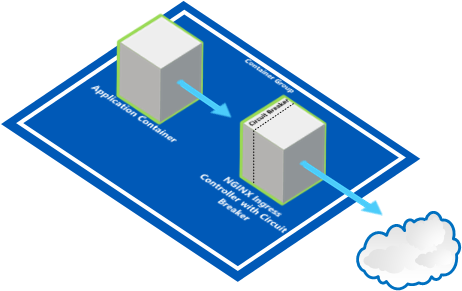
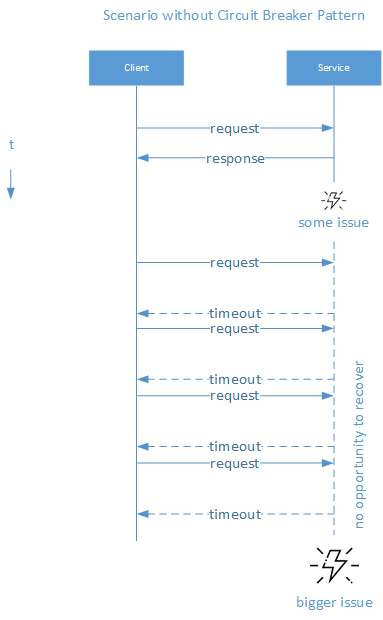
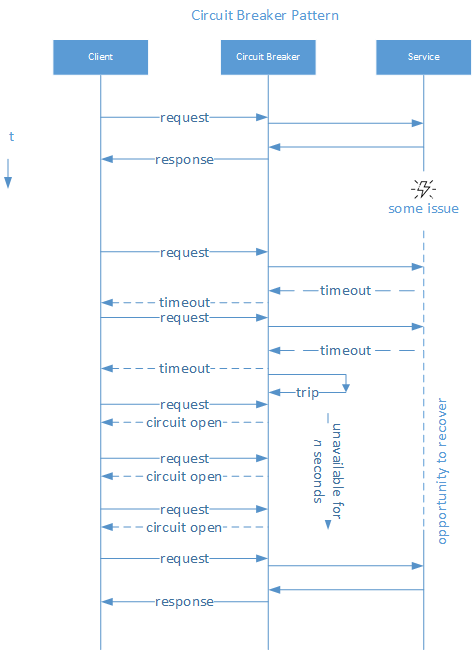

# Single Node Pattern: Circuit Breaker Pattern #
## Deploying a Circuit Breaking ambassador with NGINX Ingress and Kubernetes on AKS ##

In this lab we'll guide you through the steps to deploy a Circuit Breaker pattern as an ambassador.



## Introduction into the Circuit Breaker Pattern

A key tenet of modern application design is that failure will occur. You need to assume that one or more parts of your application will fail in some manner at some point. The **Circuit Breaker** pattern can help you prevent, mitigate and manage failures by:
- allowing failing services to recover, before sending them requests again
- re-routing traffic to alternative data sources
- rate limiting
 
To illustrate this, consider the following turn of events:



Without a **Circuit Breaker**, the **Client** will keep trying to send a request to the **Service**, even after something went wrong and the **Service** isn't able to respond in time. Because the **Client** keeps retrying, possibly with many other clients simultaneously, the **Service** will have no opportunity to recover, assuming the issue at hand is only transient of nature.

Now, consider the following turn of events:



With a Circuit Breaker, the **Client** will no longer be able to overload the **Service** with requests after the **Circuit Breaker** was "tripped" after the second failure. The **Circuit Breaker** will avoid sending the **Service** any new requests for the next *n* seconds. This allows the **Service** to recover. Once a certain time has passed, the **Circuit Breaker** will slowly start passing on requests to the **Service** again until it has fully regained strength, as illustrated in the following State Diagram:


Please check out these pages if you want to read more about the Circuit Breaker Pattern:
- [Circuit Breaker - Martin Fowler](https://martinfowler.com/bliki/CircuitBreaker.html "Circuit Breaker - by Martin Fowler")
- [NGINX Circuit Breaker Pattern](https://www.nginx.com/blog/microservices-reference-architecture-nginx-circuit-breaker-pattern/ "NGINX Circuit Breaker Pattern")

## Prerequisites

In order to run the samples in this lab,you will need the following:

- An active [Microsoft Azure](https://azure.microsoft.com/en-us/free "Microsoft Azure") Subscription
- [Azure CLI](https://docs.microsoft.com/en-us/cli/azure/overview?view=azure-cli-latest "Azure CLI") installed
- [Curl](https://curl.haxx.se/download.html "Curl") command line tool installed (for downloading ```kubectl``` as well as testing samples in this lab)
- [Kubernetes CLI (kubectl)](https://kubernetes.io/docs/tasks/tools/install-kubectl/ "Kubernetes CLI (kubectl)") installed
- A new **Resource Group** and **Container Service (AKS)** created in the [Microsoft Azure Portal](https://portal.azure.com "Microsoft Azure Portal") to run samples in.
- Open a Command Prompt window (with an active PATH environment variable pointing to Azure CLI and Kubernetes CLI)

- Although not required, we encourage you to read the book *Designing Distributed Systems* by Brendan Burns.  The samples in this lab are written with the reader of this book in mind: [https://azure.microsoft.com/en-us/resources/designing-distributed-systems/en-us/](https://azure.microsoft.com/en-us/resources/designing-distributed-systems/en-us/ "Designing Distributed Systems")


## 1. First time set up ##

If you have never used Azure CLI or Kubernetes CLI before or have used it but for a different subscription, you need to link your Azure subscription to the local Kubernetes configuration.

### 1.1 **Kubernetes CLI Local Configuration**

If you are using the Kubernetes CLI on a windows machine, it expects a ```config``` file in this folder location:

````html
%USERPROFILE%\.kube
````

For instance, if your user name is TestUser, you may find the kubectl ```config``` file in ```C:\Users\TestUser\.kube```

**Optionally:** If your Kubernetes configuration file is located elsewhere, in order for the Kubernetes CLI (kubectl) to find your configuration, you need to add the above path (including the 'config' file name) to the ```KUBECONFIG``` environment variable in a Command Prompt window, as such:

    SET KUBECONFIG=c:\pathtokubeconfig\config

 
### 1.2 **Logging into Azure from the Command Line**

In order for the ```kubectl``` statements below to be fired against the correct Azure Kubernetes (AKS) instance, you must link your Azure subscription to the local Kubernetes configuration.

First you need to sign in, by entering the following command in a Command Prompt window:


    az login

This will result in the following output:

    To sign in, use a web browser to open the page https://aka.ms/devicelogin and enter the code B9R2CY8ZP to authenticate.
    
Now, you need to open a browser and go to ```https://aka.ms/devicelogin``` and type in the code returned from the ```az login``` command: ```B9R2CY8ZP```


This will authenticate your device to Azure and a response similar to this should appear in your Command Prompt window:

    [
      {
	    "cloudName": "AzureCloud",
	    "id": "3b7912c3-ad06-426e-8627-419123727111",
	    "isDefault": true,
	    "name": "CanvizDev",
	    "state": "Enabled",
	    "tenantId": "3dad2b09-9e66-4eb8-9bef-9f44544b0222",
	    "user": {
	      "name": "testuser@canviz.com",
	      "type": "user"
	    }
      }
    ]
    
### 1.3 **Linking your Azure subscription**

Next, you need to link your Azure subscription so that the Azure CLI (```az```) will work against your environment.

    az account set --subscription "3b7912c3-ad06-426e-8627-419123727111" 

### 1.4 **Getting Kubernetes configuration from Azure**

If you haven't already created a Resource Group for this lab, you can do so now with the following command:

    az group create --name circuitbreaker --location "eastus"

And if you haven't already create an AKS cluster, you can do so now with the following command:

	az aks create --name circuitbreaker --resource-group circuitbreaker --location "eastus" –-node-count 1 --generate-ssh-keys

> **Note:** This process may take a few minutes to complete.

Then, to make sure you can use **Azure Container Service (AKS)** as our context for when running ```kubectl``` commands, you need to enter the following command:

    az aks get-credentials --resource-group circuitbreaker --name circuitbreaker

where ```circuitbreaker``` is the name of a **Resource Group** you have created for yourself in the Azure Portal and ```circuitbreaker``` is the name of the **Managed Container Service** (AKS, not ACS!) you created in the Azure Portal. 

If successful, this will result in the following output:

    Merged "circuitbreaker" as current context in C:\Users\TestUser\.kube\config

**Optionally: Set the context, if you have used other Kubernetes clusters before**

If you have been developing against a local or a different Kubernetes cluster, your current ```kubectl``` configuration may point to a different cluster. To correct this, please use the following command:

    kubectl config set-context circuitbreaker

### 1.5 **Verify the correct Kubernetes cluster**

Use the following command to verify you are talking to the correct Kubernetes cluster:

    kubectl cluster-info

The output of this command should look similar to this:

    Kubernetes master is running at https://circuitbreaker-77a9ac84.hcp.eastus.azmk8s.io:443
    Heapster is running at https://circuitbreaker-77a9ac84.hcp.eastus.azmk8s.io:443/api/v1/namespaces/kube-system/services/heapster/proxy
    KubeDNS is running at https://circuitbreaker-77a9ac84.hcp.eastus.azmk8s.io:443/api/v1/namespaces/kube-system/services/kube-dns:dns/proxy
    kubernetes-dashboard is running at https://circuitbreaker-77a9ac84.hcp.eastus.azmk8s.io:443/api/v1/namespaces/kube-system/services/kubernetes-dashboard/proxy
    
If the URLs in the output point to localhost, use the ```kubectl config set-context``` command to change the context to the correct cluster.


### 1.6 **Create a Container Registry**

In order for you to storage private Docker container images later on in this lab, you will need to create a Azure Container Registry in your Azure account first.

But to group all the examples in this lab together, you will be creating a Resource Group for this lab first (f you haven't already done so) called ```circuitbreaker```:

    az group create --name circuitbreaker --location "eastus"

Then you will create the actual Azure Container Registry, which we will call ```circuitbreaker``:

    az acr create --name circuitbreakerregistry --sku Basic --location eastus --admin-enabled --resource-group circuitbreaker

This will result in an output similar to this:

    {
      "adminUserEnabled": true,
      "creationDate": "2018-03-02T19:55:15.184411+00:00",
      "id": "/subscriptions/3b7912c3-ad06-426e-8627-419123721111/resourceGroups/circuitbreaker/providers/Microsoft.ContainerRegistry/registries/circuitbreakerregistry",
      "location": "eastus",
      "loginServer": "circuitbreakerregistry.azurecr.io",
      "name": "circuitbreakerregistry",
      "provisioningState": "Succeeded",
      "resourceGroup": "circuitbreaker",
      "sku": {
    "name": "Basic",
    "tier": "Basic"
      },
      "status": null,
      "storageAccount": null,
      "tags": {},
      "type": "Microsoft.ContainerRegistry/registries"
    }

> **Note:** You will need to take note of your Azure subscription ID above (3b7912c3-ad06-426e-8627-419123721111), you will need that in the following command:

Next, you will need to assign your Azure user as owner to the newly created Azure Container Registry:

    az ad sp create-for-rbac --scopes /subscriptions/paste_your_subscription_id_here/resourceGroups/circuitbreaker/providers/Microsoft.ContainerRegistry/registries/circuitbreakerregistry --role Owner --password Test12345

So, for instance:

    az ad sp create-for-rbac --scopes /subscriptions/3b7912c3-ad06-426e-8627-419123721111/resourceGroups/circuitbreaker/providers/Microsoft.ContainerRegistry/registries/circuitbreakerregistry --role Owner --password Test12345

That will result in an output similar to this:

    Retrying role assignment creation: 1/36
    {
      "appId": "c1d73d5d-7f01-4e4d-b621-32ebe014ebb5",
      "displayName": "azure-cli-2018-03-02-19-55-29",
      "name": "http://azure-cli-2018-03-02-19-55-29",
      "password": "Test12345",
      "tenant": "3dad2b09-9e66-4eb8-9bef-9f44544b0e74"
    }

> **Note:** Please take note of the values for **appId** and **password** above, you will need those in the next step, when you will be creating a 
> 
>  in Kubernetes and log in into Docker to link the two together. 

### 1.7. **Create in a Secret in Kubernetes**

Now you will create a Secret in Kubernetes that will allow you to start using your own private Docker images in AKS:

    kubectl create secret docker-registry circuitbreakerregistry.azurecr.io --docker-server=circuitbreakerregistry.azurecr.io --docker-username=c1d73d5d-7f01-4e4d-b621-32ebe014ebb5 --docker-password=Test12345 --docker-email=youremailaddress@yourdomain.com 

Please make sure you replace the parameter values for **docker-username**, **docker-password** with the **appId** and **password** from the previous command and replace **docker-email** with your Docker e-mail, before running the command above.

### 1.8. **Login into Docker**

Finally, you will need to log in to Docker, so you can start building and pushing your own Docker images:

    docker login circuitbreakerregistry.azurecr.io

It will ask you for your a user name and password. Please use the **appId** from the previous command as user name and the **password** from the previous command as the password. So, for instance: 

    Username: c1d73d5d-7f01-4e4d-b621-32ebe014ebb5
    Password: Test12345

## 2. Deploying the Dummy Service into Azure Container Services (AKS)

Now you have created your own Docker registry in Azure Container Registry, you can now push Docker images to this registry.

In the ```DummyServiceContainer``` folder you will find the NodeJS implementation of a container which we are going to protect from overloading by implementing a circuit breaker ambassador in front of it.

To properly test this ```DummyServiceContainer``` we *need it to fail* so that it will trigger the Circuit Breaker. To make that happen, we added a ```/fakeerrormodeon``` endpoint. Once that endpoint is called the container will start faking a failure or causing timeout issues by just not sending a response within the timeout limit. 

Consider the ```server.js```:
    
    // This is a little NodeJS server that mimicks a production service that we want to protect with a Circuit Breaker. 
    // To prove the Circuit Breaker works and stops overloading this service with calls when it is in a transient failure so it can recover, we need to fake this service to become unreachable.
    // In order to mimick this service to become unreachable for clients, we'll expose an endpoint that you can call so that this service starts behaving like it is crashed.
    // We'll fake this crash by calling a non-blocking setTimeout() statement on incoming requests, when we are in this "fake error" mode.
    // We will also expose an endpoint to get this service out of the "fake error" mode so that triggers the Circuit Breaker to go in half-open state, before returning to fully closed state (=fully working state)
    'use strict';

    const express = require('express');

    var ready = false;
    console.log('Container is not yet ready.');

    const PORT = 80;
    const HOST = '0.0.0.0';
    const app = express();

    // We will be using this boolean to mimick an issue with this service
    var fakeAnError = false;

    // We will not mess with the /alive endpoint, because that triggers the killing and recreation of the container by Kubernetes
    app.get('/alive', (req, res) => {

        console.log('/alive');

    res.status(200).send('OK');
    });

    // We will use the /ready endpoint as the health check for the Circuit Breaker configuration in NGINX (see nginx-configmap.yaml)
    app.get('/ready', (req, res) => {

        console.log('/ready');

        // If we are in error mode, we'll just return a 503
        if (fakeAnError) {
        res.status(503).send('BUSY FROM ' + req.connection.localAddress);
        } else
            if (!ready) {
                res.status(503).send('BUSY FROM ' + req.connection.localAddress);
            } else {
                res.status(200).send('OK FROM ' + req.connection.localAddress);
            }
        });

    // This will be our main endpoint which we will be calling in our test case that returns some valid response
    app.get('/', (req, res) => {

        console.log('/');

        if (!fakeAnError) {
            res.status(200).send('SOMERESPONSE FROM ' + req.connection.localAddress);
        } else {
            // Have a non-blocking delay in the response of this endpoint that waits more than the request/read timeout configured in the NGINX configuration, for more a realistic test
            setTimeout(() => {
                res.status(503).send('ERROR FROM ' + req.connection.localAddress);
            }, 30000);
        }

    });

    // These 2 endpoints will toggle the "fakeerror" mode on/off for subsequent requests
    app.post('/fakeerrormodeon', (req, res) => {

        console.log('/fakeerrormodeon');

        fakeAnError = true;
        res.status(200).send('OK FROM ' + req.connection.localAddress);
    });
    app.post('/fakeerrormodeoff', (req, res) => {

        console.log('/fakeerrormodeoff');

        fakeAnError = false;
        res.status(200).send('OK FROM ' + req.connection.localAddress);
    });

    app.listen(PORT, HOST);
    console.log(`Running on http://${HOST}:${PORT}`);

    // All is done? Then mark this server ready
    ready = true;

As you can see from this source code, calling the service at the ```/fakeerrormodeon``` endpoint will set the boolean ```fakeAnError``` to true, which in turn will make all requests to the endpoint ```/``` and the health check on the endpoint ```/ready``` fail. This is enough to trigger the Circuit Breaker into thinking the service is unhealthy.

> *Note: * In the source code above you can also see an endpoint ```/alive``` which returns OK. Even, if the ```fakeAnError``` boolean is true. This is necessary, because otherwise Kubernetes (which is managing this container) will also think the container became unhealthy and will trigger a kill and re-create of the container to bring it back up. This will interfere with our demonstration of the Circuit Breaker doing its work. So, we'll have Kubernetes think the container is healthy, even when our Circuit Breaker we implemented ourselves in NGINX thinks it is not healthy.

### 2.1. Build Docker Image for the DummyServiceContainer

Navigate to the ```DummyServiceContainer```  folder and execute the following command:

    docker build . -t circuitbreakerregistry.azurecr.io/dummyservice
   
### 2.2. Push Docker Image to Azure Container Registry

Then, execute the following command to push your Docker image to the Azure Container Registry:

    docker push circuitbreakerregistry.azurecr.io/dummyservice

### 2.3. Deploy DummyServiceContainer to Azure Container Services (AKS)

Consider the following ```dummy-deployment.yaml```:

    # This deployment fires up the dummy service that we are trying to protect from overload when it enters an unhealthy state, so that it can recover. Because this dummy-deployment 
    # exposes a /fakeerrormodeon endpoint, we can make it "fake" an error that will trigger the circuit breaker by returning a 503 from the /ready endpoint (see server.js)
    apiVersion: extensions/v1beta1
    kind: Deployment
    metadata:
      name: dummy-deployment
    spec:
      # For simplicity we'll just fire up a single replica in our load balancer for this service
      replicas: 1
      template:
        metadata:
          labels:
            app: dummy-deployment
        spec:
          containers:
          - name: dummy-depoyment
            # This is were you point to the image you deployed to the Docker image you deployed to your ACR registry
            image: circuitbreakerregistry.azurecr.io/dummyservice
            ports:
            - containerPort: 80
            livenessProbe:
              httpGet:
                # The /alive endpoint is the one we will not touch in our test case, as this will trigger a kill and recreate from Kubernetes when this does not return 200
                path: /alive
                port: 80
                scheme: HTTP
              initialDelaySeconds: 5
              periodSeconds: 10
          imagePullSecrets:
          # Here we refer to the secret you generated earlier so that you can access the Docker image from your private Docker hub / ACR registry
          - name: circuitbreakerregistry.azurecr.io

Notice the ```livenessProbe``` configuration, telling Kubernetes to check the container's health status by calling the ```/alive``` endpoint on our container every 10 seconds.

Deploy the ```DummyServiceContainer``` with the following command:

    kubectl create -f dummy-deployment.yaml

### 2.4. Expose the DummyServiceContainer

Expose the ```DummyServiceContainer``` to the outside world on port 80 by executing the following command:

    kubectl expose deployment dummy-deployment --port=80 --type=LoadBalancer --name dummy-deployment

### 2.5. Verify the DummyServiceContainer

Execute the following command to confirm that a pod is created for the ```DummyServiceContainer```:

    kubectl get pods --output=wide

This should result in an output like this:

    NAME                                READY     STATUS              RESTARTS   AGE         IP        NODE
    dummy-deployment-1077142786-cjk90   0/1       ContainerCreating   0          <invalid>   <none>    aks-nodepool1-11676488-0

While Kubernetes is issuing an IP address we can wait for the EXTERNAL IP address to be populated with the following command:

    kubectl get services --watch

Which should result in an output like this:

    NAME               TYPE           CLUSTER-IP     EXTERNAL-IP   PORT(S)        AGE
    dummy-deployment   LoadBalancer   10.0.134.219   <pending>     80:31172/TCP   <invalid>
    kubernetes         ClusterIP      10.0.0.1       <none>        443/TCP        12m

And after a few minutes:

    NAME               TYPE           CLUSTER-IP     EXTERNAL-IP      PORT(S)        AGE
    dummy-deployment   LoadBalancer   10.0.134.219   <pending>        80:31172/TCP   <invalid>
    kubernetes         ClusterIP      10.0.0.1       <none>           443/TCP        12m
    dummy-deployment   LoadBalancer   10.0.134.219   13.90.157.180    80:31172/TCP   2m

Once the EXTERNAL IP address is populated, you can use it to test the DummyServiceContainer with a cURL statement:

    curl http://13.90.157.180/alive

Which returns: 

    OK

Or:

    curl http://13.90.157.180/ready

Which returns: 

    OK

And if you would call the ```/``` endpoint:

    curl http://13.90.157.180/

It should return: 

    SOMERESPONSE

So, now you have verified the DummyServiceContainer is working as expected.

### 2.6. Deploy the Backup DummyServiceContainer

Similar to the ```dummy-deployment``` we also want to fire up a backup server that we want to see process all the requests when the dummy-deployment server becomes unhealthy.

Since this deployment will use the same Docker image you can simply fire up this backup server with the following commands:

    kubectl create -f backup-deployment.yaml
 
And then expose it to the outside world with the following command:

    kubectl expose deployment backup-deployment --port=80 --type=LoadBalancer --name backup-deployment

Then verify both the ```dummy-deployment``` and ```backup-deployment``` are working with the following command:

    kubectl get pods --output=wide
    kubectl get services

Which should result in an output similar to this:

    NAME                TYPE           CLUSTER-IP    EXTERNAL-IP     PORT(S)        AGE
    backup-deployment   LoadBalancer   10.0.172.52   <pending>       80:32245/TCP   29m
    dummy-deployment    LoadBalancer   10.0.255.90   13.72.104.153   80:32440/TCP   29m
    kubernetes          ClusterIP      10.0.0.1      <none>          443/TCP        1d

## 3. Deploying the Circuit Breaker

Now we have the DummyServiceContainer (and a backup) up and running you are ready to deploy the actual circuit breaker.

We will be demonstrating the Circuit Breaker pattern by using an NGINX Plus image in Kubernetes. NGINX Plus provides out-of-the-box features for Circuit Breaking.

> **Note:** most of these features are only available in the **commercial version** of NGINX Plus.

Before you can continue you need to build an NGINX Plus image yourself by following the instructions on this page: [https://www.nginx.com/blog/deploying-nginx-nginx-plus-docker/](https://www.nginx.com/blog/deploying-nginx-nginx-plus-docker/ "Creating a Docker Image of NGINX Plus")).

### 3.1. NGINX Plus Circuit Breaker configuration

To configure the Circuit Breaker in NGINX Plus, we will need to write a NGINX configuration that implements:
- A main upstream server accepting your requests
- A backup upstream server that will accept requests when the main upstream server becomes unhealthy
- A ```match``` block to define the conditions under which the active health checker will deem a server healthy
- An active health check that polls the servers regularly to determine if they are healthy

First you need to create a ConfigMap object of the custom NGINX configuration so that Kubernetes can read it and apply it to your NGINX Plus container later on.

Consider the following ```nginx-configmap.yaml```: 

    # A ConfigMap is basically a key-value pair dictionary that can be used to customize the NGINX default configuration
    kind: ConfigMap
    apiVersion: v1
    metadata:
      name: nginx-configuration
      labels:
        app: nginx-plus
    data:
      default.conf: |  
        upstream backend {
          zone backend 64k;
          server dummy-deployment:80;
          server backup-deployment:80 backup;
        }
        match conditions {
          status 200-399;
        }
        server {
          listen 80;
          location / {	 
            proxy_pass http://backend;
            health_check uri=/ready interval=3s fails=1 passes=1;
          }
        }
    # The default.conf section above contains the upstream and server configurations much you would expect to see in a NGINX nginx.conf configuration file.
    # They will be added to the default NGINX configuration when deploying the nginx-plus image in the circuitbreaker.yaml file.
    #
    #  default.conf: |  
    #    upstream backend {
    # The following line is important to make sure the run state of the servers is shared amongst the worker processes for all the servers
    #      zone backend 64k;
    # The dummy-deployment is our server we are trying to protect from overload in the case it is in a transient failure
    #      server dummy-deployment:80;
    # Circuit Breaker Pattern: Re-routing traffic
    # The backup-deployment is a server we will route traffic to, in case the dummy-deployment server is in a unhealthy state
    #      server backup-deployment:80 backup;
    #    }
    # The following match block describe the conditions the active health_check needs to meet in order for the upstream server to be considered healthy. 
    # If this condition is not met, the server will be considered unhealthy and (temporary) removed from the list of upstream servers
    #    match conditions {
    #      status 200-399;
    #    }
    #    server {
    #      listen 80;
    # This tells NGINX to send all traffic to the root / endpoint to the upstream backend servers (see above)
    #      location / {	 
    #        proxy_pass http://backend;
    # Circuit Breaker Pattern: Active Health Checking: This monitors the upstream servers every 3 seconds on the /ready endpoint (see server.js) which in case it does not match
    # the conditions above after the first fail, will be removed from the upstreams list and will no longer receive. This triggers the Open state of the Circuit Breaker Pattern.
    # Only after the /ready endpoint returns 200 again after the first pass, will the server be deemed healthy again and return in the list of available upstream servers. 
    # This corresponds to the Closed state of the Circuit Break Pattern. In the commercial version of NGINX a server configuration slow_start can be used to gradually
    # send requests to a recovered server, rather than all requests as in this example. This corresponds to a truely Half Open state of the Circuit Break Pattern.
    #        health_check uri=/ready interval=3s fails=1 passes=1;
    #      }
    #    }
    #
  
This custom NGINX configuration will tell NGINX Plus to perform an active health check on the DummyServiceContainer  to determine if it is healthy. Once you trigger the DummyServiceContainer to start "faking" failures it will trigger the circuit breaker and the backup server will now start serving all the requests.  

#### 3.1.1. health_check
Notice the ```health_check``` block. This custom NGINX configuration will tell NGINX Plus to actively check the health of the ```DummyServiceContainer``` (exposed as http://dummy-deployment) at the ```/ready``` endpoint (not to confuse with the ```/active``` end-point which was for Kubernetes to avoid killing the ```DummyServiceContainer``` while we test the Circuit Breaker pattern).

#### 3.1.2. match conditions
Then, take a look at the ```match conditions``` block above. That will tell NGINX Plus that for the DummyServiceContainer to be considered healthy, it needs to match the conditions mentioned. ```DummyServiceContainer``` is considered healthy, when:
- The HTTP response status code is between 200 and 339, and
- The response body is "OK"

#### 3.1.3. Deploy the ConfigMap

Enter the following command to create the ConfigMap object for this configuration:

    kubectl create -f nginx-configmap.yaml

### 3.2. Deploy and Expose the NGINX Plus image

Now, let's deploy the NGINX Plus image and expose it to the outside world so we can start our demonstration of the Circuit Breaker:

    apiVersion: apps/v1beta1 # for versions before 1.9.0 use apps/v1beta2
    kind: Deployment
    metadata:
      name: circuitbreaker
    spec:
      selector:
        matchLabels:
          app: circuitbreaker
      replicas: 1 # The number of replicas to fire up. For now, we'll fire up 1, for simplicity.
      template: 
        metadata:
          labels:
            app: circuitbreaker
        spec:
          containers:
          # If you decided to build your own NGINX Docker image, update the following line to point to your Docker hub or ACR Registry (or where ever you deployed the NGINX Plus image)
          - image: tylerlu/nginxplus
            name: circuitbreaker
            ports:
            - containerPort: 80
            # Add a special VolumeMount to the NGINX Plus image that will use the ConfigMap you created in another command (see nginx-configmap.yaml) to override the default NGINX configuration settings
            volumeMounts:
            - name: config-volume
              mountPath: /etc/nginx/conf.d
          volumes:
          - name: config-volume
            configMap:
              name: nginx-configuration

    ---

    apiVersion: v1
    kind: Service
    metadata:
      name: circuitbreaker
      labels:
        app: circuitbreaker
    spec:
      type: LoadBalancer
      ports:
      - port: 80
        targetPort: 80
      selector:
        app: circuitbreaker

Enter the following command:

    kubectl create -f circuitbreaker.yaml

Now, you can check whether the NGINX Plus image was successfully deploy with the following command:

    kubectl get pods --output=wide
    kubectl get services --watch

Which should result in an output similar to this:

    backup-deployment-961811812-8fhgb   1/1       Running             0          52m         10.244.0.104   aks-nodepool1-11676488-0
    circuitbreaker-2451672288-qrbrv     0/1       ContainerCreating   0          <invalid>   <none>         aks-nodepool1-11676488-0
    dummy-deployment-2078959012-rxfd3   1/1       Running             0          52m         10.244.0.103   aks-    nodepool1-11676488-0

    NAME                TYPE           CLUSTER-IP    EXTERNAL-IP     PORT(S)        AGE
    backup-deployment   LoadBalancer   10.0.172.52   <pending>       80:32245/TCP   29m
    circuitbreaker      ClusterIP      10.0.219.63   <pending>       80/TCP         11m
    dummy-deployment    LoadBalancer   10.0.255.90   13.72.104.153   80:32440/TCP   29m
    kubernetes          ClusterIP      10.0.0.1      <none>          443/TCP        1d

And after a while, the EXTERNAL-IP address of the ```circuitbreaker``` should be populated:
    circuitbreaker      ClusterIP      10.0.219.63   13.72.105.102   80/TCP         11m


## 4. Test your Circuit Breaker

### 4.1. Verify that the DummyServiceContainer is working correctly (=Closed State)

Execute the following command 3 times and you will see the same result each time (where the IP address matches the EXTERNAL-IP address of the ```circuitbreaker``` service):

    curl -v http://13.72.105.102

Which should return the following result every time:

    > GET / HTTP/1.1
    > User-Agent: curl/7.35.0
    > Host: circuitbreaker
    > Accept: */*
    >
    < HTTP/1.1 200 OK
    < Server: nginx/1.13.7
    < Date: Wed, 04 Apr 2018 23:48:51 GMT
    < Content-Type: text/html; charset=utf-8
    < Content-Length: 30
    < Connection: keep-alive
    < X-Powered-By: Express
    < ETag: W/"1e-giY/d6ahGpyL78AYJfuF81A6x5M"
    <
    SOMERESPONSE FROM 10.244.0.103

Notice the IP address on the last line that should match the CLUSTER-IP of the ```dummy-deployment-xxx-yyy``` pod (see ```kubectl get pods --output=wide```).

### 4.1. Have the DummyServiceContainer cause timeouts

Now, let's see if we can have the ```DummyServiceContainer``` "fake" a problem. Execute the following cURL command to have the ```DummyServiceContainer``` start causing timeouts (where the IP address matches the EXTERNAL-IP address of the ```dummy-deployment``` service):

    curl -d "" -s -D - http://13.72.104.153/fakeerrormodeon  

Which returns: 

    OK

Now, the DummyContainerService has become unhealthy. 

### 4.2. Verify that the backup-deployment started processing the requests

Execute the following command 3 times and you will see the same result each time (where the IP address matches the EXTERNAL-IP address of the ```circuitbreaker``` service):

    curl -v http://13.72.105.102

Which should return the following result every time:

    > GET / HTTP/1.1
    > User-Agent: curl/7.35.0
    > Host: circuitbreaker
    > Accept: */*
    >
    < HTTP/1.1 200 OK
    < Server: nginx/1.13.7
    < Date: Wed, 04 Apr 2018 23:48:51 GMT
    < Content-Type: text/html; charset=utf-8
    < Content-Length: 30
    < Connection: keep-alive
    < X-Powered-By: Express
    < ETag: W/"1e-giY/d6ahGpyL78AYJfuF81A6x5M"
    <
    SOMERESPONSE FROM 10.244.0.104

Now, notice the IP address on the last line that now matches the CLUSTER-IP of the ```backend-deployment-xxx-yyy``` pod (see ```kubectl get pods --output=wide```) and no longer the ```dummy-deployment```.

This proves the circuit breaker kicked in.

### 4.3. Make the DummyServiceContainer healthy again.

Now, let's stop having the ```DummyServiceContainer``` "fake" problems, by executing the following cURL command:

    curl -d "" -s -D - http://13.72.104.153/fakeerrormodeoff

Which returns: 

    OK

Now, the DummyContainerService has become healthy again.

### 4.4. Verify that the DummyServiceContainer is accepting requests again

Execute the following command 3 times and you will see the same result each time (where the IP address matches the EXTERNAL-IP address of the ```circuitbreaker``` service):

    curl -v http://13.72.105.102

Which should return the following result every time:

    > GET / HTTP/1.1
    > User-Agent: curl/7.35.0
    > Host: circuitbreaker
    > Accept: */*
    >
    < HTTP/1.1 200 OK
    < Server: nginx/1.13.7
    < Date: Wed, 04 Apr 2018 23:48:51 GMT
    < Content-Type: text/html; charset=utf-8
    < Content-Length: 30
    < Connection: keep-alive
    < X-Powered-By: Express
    < ETag: W/"1e-giY/d6ahGpyL78AYJfuF81A6x5M"
    <
    SOMERESPONSE FROM 10.244.0.103

Notice the IP address on the last line that now matches the CLUSTER-IP of the ```dummy-deployment-xxx-yyy``` pod again (see ```kubectl get pods --output=wide```).

That proves the Circuit Breaker worked and this concludes the lab.


## 5. NGINX Plus Background Information 

NGINX Plus has a robust active health‑check system with many options for checking and responding to health issues.

It also supports rate-limiting, slow-starts and caching in addition to the features discussed in this lab to handle or even prevent failures.

### 5.1. Passive Health Checking vs. Active Health Checking

For passive health checks, NGINX and NGINX Plus monitor transactions **as they happen** and try to resume failed connections. If the transaction still cannot be resumed, NGINX and NGINX Plus mark the server as unavailable and temporarily stop sending requests to it until it is marked active again.

The circuit breaker pattern can **prevent failure before it happens** by reducing traffic to an unhealthy service or routing requests away from it. This requires an active health check connected to an introspective health monitor on each service. Unfortunately, a passive health‑check does not do the trick, as it only checks for failure – at which point, it is already too late to take preventative action. It is for this reason that the open source NGINX software (OSS) cannot implement the circuit breaker pattern – it only supports passive health checks.

NGINX Plus can periodically check the health of upstream servers by sending special health‑check requests to each server and verifying the correct response.

You can read more about the Circuit Breaker Patter in NGINX Plus here: [https://www.nginx.com/blog/microservices-reference-architecture-nginx-circuit-breaker-pattern/](https://www.nginx.com/blog/microservices-reference-architecture-nginx-circuit-breaker-pattern/ "https://www.nginx.com/blog/microservices-reference-architecture-nginx-circuit-breaker-pattern/")

## 6. Summary

These are the commands you executed:

    docker build . -t circuitbreakerregistry.azurecr.io/dummyservice
    docker push circuitbreakerregistry.azurecr.io/dummyservice

    kubectl create -f dummy-deployment.yaml
    kubectl create -f backup-deployment.yaml

    kubectl expose deployment dummy-deployment --port=80 --type=LoadBalancer --name dummy-deployment
    kubectl expose deployment backup-deployment --port=80 --type=LoadBalancer --name backup-deployment

    kubectl get pods --output=wide
    kubectl get services
    kubectl get services --watch

    kubectl create -f nginx-configmap.yaml
    kubectl create -f circuitbreaker.yaml

    kubectl get pods --output=wide
    kubectl get services 

    curl -v http://13.72.105.102
    curl -d "" -s -D - http://13.72.104.153/fakeerrormodeon
    curl -v http://13.72.105.102
    curl -d "" -s -D - http://13.72.104.153/fakeerrormodeoff
    curl -v http://13.72.105.102

And if you do not like to wait for external IP address to be issued, so you can fire cURL statements inside the pods.

    kubectl run curl-circuitbreaker-deployment --image=radial/busyboxplus:curl -i --tty --rm

These are the commands to quickly delete the deployments, so you can repeat the steps above:

    kubectl delete service circuitbreaker
    kubectl delete deployment circuitbreaker

    kubectl delete configmap nginx-configuration

    kubectl delete service dummy-deployment
    kubectl delete deployment dummy-deployment

    kubectl delete service backup-deployment
    kubectl delete deployment backup-deployment

    docker rmi circuitbreakerregistry.azurecr.io/dummyservice

## 7. Conclusion

In this lab you learned how to deploy an NGINX Plus image and configure it to implement a basic Circuit Breaker pattern.

## 8. Contributors ##
| Roles                                    			| Author(s)                                			|
| -------------------------------------------------	| ------------------------------------------------- |
| Project Lead / Architect / Lab Manuals		    | Manfred Wittenbols (Canviz) @mwittenbols          |
| Technical Editor                       			| Todd Baginski (Canviz) @tbag                      |
| Sponsor / Support                        			| Phil Evans (Microsoft)                            |
| Sponsor / Support                        			| Anand Chandramohan (Microsoft)                    |

## 9. Version history ##

| Version | Date          		| Comments        |
| ------- | ------------------- | --------------- |
| 1.0     | March 20, 2018 	    | Initial release |

## Disclaimer ##
**THIS CODE IS PROVIDED *AS IS* WITHOUT WARRANTY OF ANY KIND, EITHER EXPRESS OR IMPLIED, INCLUDING ANY IMPLIED WARRANTIES OF FITNESS FOR A PARTICULAR PURPOSE, MERCHANTABILITY, OR NON-INFRINGEMENT.**

----------


**Azure Container Service (AKS)** 

