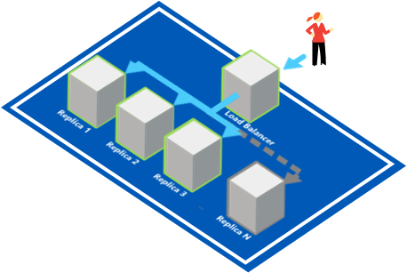
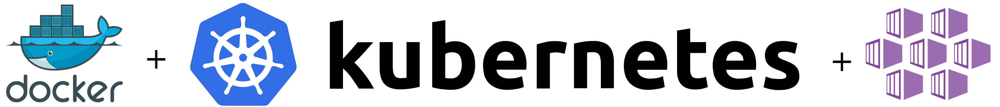

# Serving Pattern: Load Balancing Server #
## Deploying a stateless replicated service behind a load balancer with Kubernetes on Azure Kubernetes Servies (AKS) ##

In this lab we'll guide you through the steps to deploy a replicated load balancing service that will process requests for the definition of English words. The requests will be processed by a small NodeJS application that we will fire up in Kubernetes using a pre-existing Docker image.

 

## Prerequisites

In order to run the samples in this lab, you will need the following:

- An active [Microsoft Azure](https://azure.microsoft.com/en-us/free "Microsoft Azure") Subscription
- [Azure CLI](https://docs.microsoft.com/en-us/cli/azure/overview?view=azure-cli-latest "Azure CLI") installed
- [Curl](https://curl.haxx.se/download.html "Curl") command line tool installed (for downloading ```kubectl``` as well as testing samples in this lab)
- [Kubernetes CLI (kubectl)](https://kubernetes.io/docs/tasks/tools/install-kubectl/ "Kubernetes CLI (kubectl)") installed
- A new **Resource Group** and **Azure Kubernetes Service (AKS)** created in the [Microsoft Azure Portal](https://portal.azure.com "Microsoft Azure Portal") to run samples in.
- Open a Command Prompt window (with an active PATH environment variable pointing to Azure CLI and Kubernetes CLI)

- Although not required, we encourage you to read the book *Designing Distributed Systems* by Brendan Burns.  The samples in this lab are written with the reader of this book in mind: [https://azure.microsoft.com/en-us/resources/designing-distributed-systems/en-us/](https://azure.microsoft.com/en-us/resources/designing-distributed-systems/en-us/ "Designing Distributed Systems")

## 1. First time set up ##

If you have never used Azure CLI or Kubernetes CLI before or have used it but for a different subscription, you need to link your Azure subscription to the local Kubernetes configuration.

### 1.1 **Kubernetes CLI Local Configuration**

If you are using the Kubernetes CLI on a windows machine, it expects a ```config``` file in this folder location:

````html
%USERPROFILE%\.kube
````

For instance, if your user name is TestUser, you may find the kubectl ```config``` file in ```C:\Users\TestUser\.kube```

**Optionally:** If your Kubernetes configuration file is located elsewhere, in order for the Kuberneter CLI (kubectl) to find your configuration, you need to add the above path (including the 'config' file name) to the ```KUBECONFIG``` environment variable in a Command Prompt window, like this:

    SET KUBECONFIG=c:\pathtokubeconfig\config

 
### 1.2 **Logging into Azure from the Command Line**

In order for the ```kubectl``` statements below to be fired against the correct Azure Kubernetes (AKS) instance, you need to link your Azure subscription to the local Kubernetes configuration.

First you need to sign in, by entering the following command in a Command Prompt window:

    az login

This will result in the following output:

    To sign in, use a web browser to open the page https://aka.ms/devicelogin and enter the code B9R2CY8ZP to authenticate.
    
Now, open a browser and go to ```https://aka.ms/devicelogin``` and type in the code as returned from the ```az login``` command: ```B9R2CY8ZP```


This will authenticate your device again Azure and a response similar to this should appear in your Command Prompt window:

    [
      {
	    "cloudName": "AzureCloud",
	    "id": "3b7912c3-ad06-426e-8627-419123727111",
	    "isDefault": true,
	    "name": "CanvizDev",
	    "state": "Enabled",
	    "tenantId": "3dad2b09-9e66-4eb8-9bef-9f44544b0222",
	    "user": {
	      "name": "testuser@canviz.com",
	      "type": "user"
	    }
      }
    ]
    
### 1.3 **Linking your Azure subscription**

Next, link your Azure subscription so  the Azure CLI (```az```) will work with your environment.

    az account set --subscription "3b7912c3-ad06-426e-8627-419123727111" 

### 1.4 **Getting Kubernetes configuration from Azure**

Then, ensure you can use the **Azure Kubernetes Service (AKS)** as your context when running ```kubectl``` commands, by entering the following command:

    az aks get-credentials --resource-group TestKub --name TestKub1

where ```TestKub``` is the name of a **Resource Group** you have created for yourself in the Azure Portal and ```TestKub1``` is the name of the **Kubernetes Service** (AKS) you created in the Azure Portal. 

If successful, this will result in the following output:

    Merged "TestKub1" as current context in C:\Users\TestUser\.kube\config


**Optional: Set the context, if you have used other Kubernetes clusters before**

If you have been developing against a local or a different Kubernetes cluster, your current ```kubectl``` configuration may point to a different cluster. To correct this, please use the following command:

    kubectl config set-context TestKub1


### 1.5 **Verify the correct Kubernetes cluster**

In order to verify you are indeed talking to the correct Kubernetes cluster, use the following command:

    kubectl cluster-info

The output of this command should look similar to this:

    Kubernetes master is running at https://testkub1-77a9ac84.hcp.eastus.azmk8s.io:443
    Heapster is running at https://testkub1-77a9ac84.hcp.eastus.azmk8s.io:443/api/v1/namespaces/kube-system/services/heapster/proxy
    KubeDNS is running at https://testkub1-77a9ac84.hcp.eastus.azmk8s.io:443/api/v1/namespaces/kube-system/services/kube-dns:dns/proxy
    kubernetes-dashboard is running at https://testkub1-77a9ac84.hcp.eastus.azmk8s.io:443/api/v1/namespaces/kube-system/services/kubernetes-dashboard/proxy
    
If the URLs in the output point to localhost, please use the ```kubectl config set-context``` command to change the context to the correct cluster.

## 2. Deploying a Replicated Docker Image to Kubernetes



First you will deploy 3 replicas of a small NodeJS application inside an existing ready-to-use Docker image. For this step you will use the publicly accessible ```dictionary-server``` Docker image at ```brendanburns/dictionary-server``` as referred to by the example in Brendan Burns' book *Designing Distributed Systems*: [https://azure.microsoft.com/en-us/resources/designing-distributed-systems/en-us/](https://azure.microsoft.com/en-us/resources/designing-distributed-systems/en-us/ "Designing Distributed Systems")

This ```dictionary-server``` is a small NodeJS application that takes HTTP request paths with an English word and responds with the definition of that word. E.g. a request to ```http://someserver/dog``` returns:
    
    A quadruped of the genus Canis, esp. the domestic dog (C.familiaris).

Consider the deployment Yaml file ```loadbalancer-deployment.yaml```:

    apiVersion: apps/v1beta1 # for versions before 1.9.0 use apps/v1beta2
    kind: Deployment
    metadata:
      name: loadbalancer-deployment
    spec:
      replicas: 3
      template:
        metadata:
          labels:
            app: loadbalancer-deployment
        spec:
          containers:
          - name: server
            image: brendanburns/dictionary-server
            ports:
            - containerPort: 8080
            readinessProbe:
              httpGet:
                path: /ready
                port: 8080
              initialDelaySeconds: 5
              periodSeconds: 5

This configuration file tells Kubernetes to fire up 3 replicas of the Docker images at ```brendanburns/dictionary-server``` and make them available on port 8080. 

### 2.1. The readinessProbe configuration

This configuration file also tells Kubernetes to wait to make this deployment accessible for the outside world until the Docker image actually has finished starting up and loading its data. It does so by using the ```readinessProbe``` configuration block.

> **Note:** There is a significant difference between an application being live and ready. An application can be live, but not yet ready to serve requests because it may need to load data. When configuring a ```readinessProbe``` configuration block, Kubernetes will not serve the pod any traffic until it becomes ready.

### 2.2. Create the Deployment in Kubernetes

Now, execute the following command to create the deployment:

    kubectl create -f loadbalancer-deployment.yaml

This will create a deployment of 3 pods, as you can see when you execute the following command:

    kubectl get pods --output=wide

This will show an output similar to this:

    NAME                                         READY     STATUS    RESTARTS   AGE       IP             NODE
    loadbalancer-deployment-1238156414-0llvz     1/1       Running   0          21s       10.244.0.151   aks-agentpool-25428128-1
    loadbalancer-deployment-1238156414-93qfz     1/1       Running   0          21s       10.244.1.123   aks-agentpool-25428128-0
    loadbalancer-deployment-1238156414-rzvhd     1/1       Running   0          21s       10.244.0.152   aks-agentpool-25428128-1 

This, however, does not yet expose an IP address to the outside world. You will do that in the next step when you expose your Deployment.

## 2.3. Expose our Replicated Load Balancing Service:

Once you execute the following command:

    kubectl expose deployment loadbalancer-deployment --port=8080 --type=LoadBalancer

the Service will be accessible from the outside world. 

## 3. Confirm our Pods are running:

Execute the following command:

    kubectl get pods --output=wide

This should result in an output similar to this:

    NAME                                         READY     STATUS    RESTARTS   AGE       IP             NODE
    loadbalancer-deployment-1238156414-0llvz     1/1       Running   0          1h        10.244.0.151   aks-agentpool-25428128-1
    loadbalancer-deployment-1238156414-93qfz     1/1       Running   0          1h        10.244.1.123   aks-agentpool-25428128-0
    loadbalancer-deployment-1238156414-rzvhd     1/1       Running   0          1h        10.244.0.152   aks-agentpool-25428128-1

 Here you see the 3 replicated pods running.

## 4. Confirm our Service is accessible

The following command lists all your services:

    kubectl get services --watch

This should result in an output similar to this:

    NAME                          TYPE           CLUSTER-IP     EXTERNAL-IP     PORT(S)        AGE
    staticfilesmulti-deployment   LoadBalancer   10.0.58.156    <pending>       80:31154/TCP   8m

> **Note:** By adding the --watch flag you force the CLI to wait for any updates from the command. Once the EXTERNAL-IP address is assigned it will show up like this:

    NAME                          TYPE           CLUSTER-IP     EXTERNAL-IP     PORT(S)        AGE
    staticfilesmulti-deployment   LoadBalancer   10.0.58.156    <pending>       80:31154/TCP   8m
    staticfilesmulti-deployment   LoadBalancer   10.0.58.156    52.186.70.196   80:31154/TCP   8m


## 5. Confirm our Replicated Load Balancing Service is working

Now you have an external IP address and you can access the service with a browser or a cURL command, like this:

    curl http://52.186.70.196:8080/dog

Here is the expected result:

    A quadruped of the genus Canis, esp. the domestic dog (C.familiaris).


## 6. Summary

Here is a summary of the statements that you have executed to deploy the load balancing pod:

    kubectl create -f loadbalancer-deployment.yaml
    kubectl create -f loadbalancer-service.yaml
    kubectl expose deployment loadbalancer-deployment --port=8080 --type=LoadBalancer
    kubectl get pods --output=wide
    kubectl get services
    kubectl get services --watch
    
You can copy & paste all the statements into a Command Prompt window, which will execute them one by one.

Here are the statements to tear down the pod, so you can re-run the statements above again:
    
    kubectl delete deployment loadbalancer-deployment
    kubectl delete service loadbalancer-service
    kubectl delete service loadbalancer-deployment

## 7. Conclusion

In this lab you deployed a Docker image in Kubernetes, used it as a back-end to replicate load balancing service and exposed it to the outside world.

## 8. Contributors ##
| Roles                                    			| Author(s)                                			|
| -------------------------------------------------	| ------------------------------------------------- |
| Project Lead / Architect / Lab Manuals		    | Manfred Wittenbols (Canviz) @mwittenbols          |
| Technical Editor                       			| Todd Baginski (Canviz) @tbag                      |
| Sponsor / Support                        			| Phil Evans (Microsoft)                            |
| Sponsor / Support                        			| Anand Chandramohan (Microsoft)                    |

## 9. Version history ##

| Version | Date          		| Comments        |
| ------- | ------------------- | --------------- |
| 1.1     | March 29, 2018 	    | Internal review |
| 1.0     | February 21, 2018 	| Initial release |

## Disclaimer ##
**THIS CODE IS PROVIDED *AS IS* WITHOUT WARRANTY OF ANY KIND, EITHER EXPRESS OR IMPLIED, INCLUDING ANY IMPLIED WARRANTIES OF FITNESS FOR A PARTICULAR PURPOSE, MERCHANTABILITY, OR NON-INFRINGEMENT.**

----------


**Azure Kubernetes Service (AKS)** 

