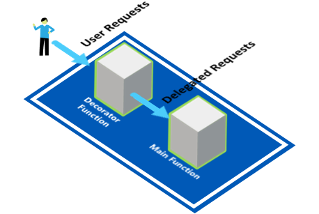
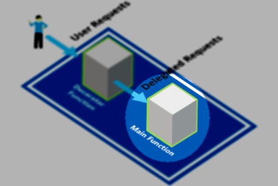
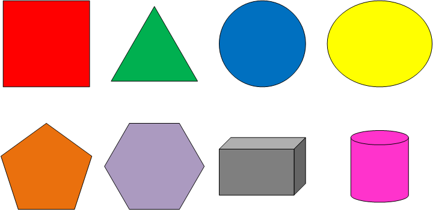
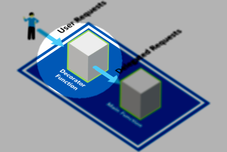
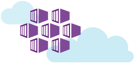

# Serving Pattern: Decorator Function #
## Deploying a Function-as-a-Service (FaaS) in Kubernetes with Kubeless on Azure Container Services (AKS) ##

In this lab we will be use the Decorator Pattern to implement a Function that adds default values and performs transformations to the input of an HTTP RESTful API.

 
 
## Prerequisites

- An active [Microsoft Azure](https://azure.microsoft.com/en-us/free "Microsoft Azure") Subscription
- [Azure CLI](https://docs.microsoft.com/en-us/cli/azure/overview?view=azure-cli-latest "Azure CLI") installed
- [Curl](https://curl.haxx.se/download.html "Curl") command line tool installed (for downloading ```kubectl``` as well as testing samples in this lab)
- [Kubernetes CLI (kubectl)](https://kubernetes.io/docs/tasks/tools/install-kubectl/ "Kubernetes CLI (kubectl)") installed
- [Kubeless CLI (kubeless)](https://github.com/kubeless/kubeless/releases "Kubeless CLI (kubeless)") installed
- A new **Resource Group** and **Container Service (AKS)** created in the [Microsoft Azure Portal](https://portal.azure.com "Microsoft Azure Portal") to run samples in.
- Open a Command Prompt window (with an active PATH environment variable pointing to Azure CLI and Kubernetes CLI)

- Although not required, we encourage you to read the book *Designing Distributed Systems* by Brendan Burns. The samples in this lab are written with the reader of this book in mind: [https://azure.microsoft.com/en-us/resources/designing-distributed-systems/en-us/](https://azure.microsoft.com/en-us/resources/designing-distributed-systems/en-us/ "Designing Distributed Systems")

## 1. First time set up ##

If you have never used Azure CLI or Kubernetes CLI before or have used it but for a different subscription, you need to link your Azure subscription to the local Kubernetes configuration.

### 1.1 **Kubernetes CLI Local Configuration**

If you are using the Kubernetes CLI on a windows machine, it expects a ```config``` file in this folder location:

````html
%USERPROFILE%\.kube
````

For instance, if your user name is TestUser, you may find the kubectl ```config``` file in ```C:\Users\TestUser\.kube```

**Optionally:** If your Kubernetes configuration file is located elsewhere, in order for the Kuberneter CLI (kubectl) to find your configuration, you need to add the above path (including the 'config' file name) to the ```KUBECONFIG``` environment variable in a Command Prompt window, like this:

    SET KUBECONFIG=c:\pathtokubeconfig\config

 
### 1.2 **Logging into Azure from the Command Line**

In order for the ```kubectl``` statements below to be fired against the correct Azure Kubernetes (AKS) instance, you need to link your Azure subscription to the local Kubernetes configuration.

First you need to sign in,  by entering the following command in a Command Prompt window:


    az login

This will result in the following output:

    To sign in, use a web browser to open the page https://aka.ms/devicelogin and enter the code B9R2CY8ZP to authenticate.
    
Now, open a browser and go to ```https://aka.ms/devicelogin``` and type in the code as returned from the ```az login``` command: ```B9R2CY8ZP```


This will authenticate your device again Azure and a response similar to this should appear in your Command Prompt window:

    [
      {
	    "cloudName": "AzureCloud",
	    "id": "3b7912c3-ad06-426e-8627-419123727111",
	    "isDefault": true,
	    "name": "CanvizDev",
	    "state": "Enabled",
	    "tenantId": "3dad2b09-9e66-4eb8-9bef-9f44544b0222",
	    "user": {
	      "name": "testuser@canviz.com",
	      "type": "user"
	    }
      }
    ]
    
### 1.3 **Linking your Azure subscription**

Next, link your Azure subscription so that the Azure CLI (```az```) will work against your environment.

    az account set --subscription "3b7912c3-ad06-426e-8627-419123727111" 

### 1.4 **Getting Kubernetes configuration from Azure**

Then, ensure you can use the **Azure Container Service (AKS)** as your context when running ```kubectl``` commands, by entering the following command:

    az aks get-credentials --resource-group TestKub --name TestKub1

where ```TestKub``` is the name of a **Resource Group** you have created for yourself in the Azure Portal and ```TestKub1``` is the name of the **Managed Container Service** (AKS, not ACS!) you created in the Azure Portal. 

If successful, this will result in the following output:

    Merged "TestKub1" as current context in C:\Users\TestUser\.kube\config


**Optionally: Set the context, if you have used other Kubernetes clusters before**

If you have been developing against a local or a different Kubernetes cluster, your current ```kubectl``` configuration may point to a different cluster. To correct this, please use the following command:

    kubectl config set-context TestKub1


### 1.5 **Verify the correct Kubernetes cluster**

In order to verify that you are indeed talking to the correct Kubernetes cluster, use the following command:

    kubectl cluster-info

The output of this command should look similar to this:

    Kubernetes master is running at https://testkub1-77a9ac84.hcp.eastus.azmk8s.io:443
    Heapster is running at https://testkub1-77a9ac84.hcp.eastus.azmk8s.io:443/api/v1/namespaces/kube-system/services/heapster/proxy
    KubeDNS is running at https://testkub1-77a9ac84.hcp.eastus.azmk8s.io:443/api/v1/namespaces/kube-system/services/kube-dns:dns/proxy
    kubernetes-dashboard is running at https://testkub1-77a9ac84.hcp.eastus.azmk8s.io:443/api/v1/namespaces/kube-system/services/kubernetes-dashboard/proxy
    
If the URLs in the output point to localhost, please use the ```kubectl config set-context``` command to change the context to the correct cluster.

### 1.6 Install Kubeless

In order to use the kubeless FaaS framework,youwe need to deploy Kubeless on top of your Kubernetes cluster. 

To do this, execute the following command:

    kubectl create ns kubeless
    curl -sL https://github.com/kubeless/kubeless/releases/download/v0.4.0/kubeless-v0.4.0.yaml | kubectl create -f -

This will result in an output similar to this:

    serviceaccount "controller-acct" created
    service "broker" created
    statefulset "kafka" created
    configmap "kubeless-config" created
    deployment "kubeless-controller" created
    service "zoo" created
    statefulset "zoo" created
    service "zookeeper" created
    customresourcedefinition "functions.kubeless.io" created
    service "kafka" created

## 2. Create Main function

 

### 2.1. Create a Main function that stores Shapes in a database

 
 
First, create a simple **Main function** in Python that will store shapes in a database. A shape will be defined by a JSON object with the attributes:


- Name
- Color
- Number of dimensions 
  
You should be able to call the Main function with a parameter like one of these JSON objects:

    {"Name":"Square","Dimensions":2,"Color":"Red"}
    {"Name":"Triangle","Dimensions":2,"Color":"Green"}

Which it will store in some persistence layer, although the implementation of actually storing the object is out of scope for this lab.

### 2.2. Create Main function using Python

> **Note:** If you prefer JavaScript over Python, please skip to Paragraph 2.3

#### 2.2.1 Main function ```main.py```

Consider the following Python function ```main.py```:
    	
    def handler(context):
    
      # TODO: Implement persistence. 
      # Do something usefull with the data, but for demo purposes we will just return the JSON object we received during the request
    
      return context.body.getvalue()
      	  
This function takes in any JSON body and returns it straight away as a response to the request.

> **Note:** You will not actually implement any persistence logic.  The Main function just returns the input.

#### 2.2.2 Deploy Main Python function

Deploy this Python function to Kubeless:

    kubeless function deploy main-storeshape --runtime python2.7 --from-file main.py --handler main.handler --trigger-http

This creates a Kubernetes Pod called main-storeshape which contains the Kubeless function.


### 2.3. Optional: Create Main function using JavaScript

#### 2.3.1 Main function ```main.js```

Consider the following Python function ```main.js```:
    	
    module.exports = {
      handler: (req, res) => {
        console.log(req.body);
        res.setHeader('Content-Type', 'application/json');
        res.end(JSON.stringify(req.body));
      }
    };
      	  
This function takes in any JSON body and returns it straight away as response to the request.

> **Note:** You will not actually implement any persistence logic.  The Main function just returns the input.

#### 2.3.2 Deploy Main JavaScript function

Deploy this JavaScript function to Kubeless:

    kubeless function deploy main-storeshape --runtime nodejs6 --from-file main.js --handler main.handler --trigger-http

This creates a Kubernetes Pod called main-storeshape which contains the Kubeless function.


### 2.4. Test Main function

Test the function by executing the following command:

    kubeless function call main-storeshape --data "{\"Name\":\"Square\",\"Dimensions\":2, \"Color\":\"Red\"}"

It should return the following output:

    { "Name": "Square", "Color": "Red", "Dimensions": 2 }

If you would execute the following command:

    kubeless function call main-storeshape --data "{\"Name\":\"Square\",\"Dimensions\":2}"

You should see the following output:

    { "Name": "Square", "Dimensions": 2 }

And so forth...

### 2.5. Expose Main function

In order for the Decorator function to access the Main function, you need to expose the Main function to the outside world:

    kubectl expose deployment main-storeshape --port=8080 --type=LoadBalancer --name main-storeshape-deployment

This command exposes the Main function on port 8080. By entering the following command, you will wait for the IP address to be allocated.  You will need that IP address later when you implement the Decorator function.

    kubectl get services --watch

This will result in an output like this:

    NAME                              TYPE           CLUSTER-IP     EXTERNAL-IP     PORT(S)          AGE
    main-storeshape                   ClusterIP      10.0.53.224    <none>          8080/TCP         1m
    main-storeshape-deployment        LoadBalancer   10.0.33.15     <pending>       8080:30625/TCP   1m

And after a few minutes, when the EXTERNAL-IP is populated, the output will look like this:

    NAME                              TYPE           CLUSTER-IP     EXTERNAL-IP     PORT(S)          AGE
    main-storeshape                   ClusterIP      10.0.53.224    <none>          8080/TCP         2m
    main-storeshape-deployment        LoadBalancer   10.0.33.15     <pending>       8080:30625/TCP   2m
    main-storeshape-deployment        LoadBalancer   10.0.33.15     52.165.129.49   8080:30625/TCP   1m

Please take note of the IP address, you will need it later.

### 2.6. Test Main function from the outside world

Now that the Main function has an external IP address, you can access it and send an HTTP request to it, with a cURL statement:

    curl -H "Content-Type: application/json" -d "{\"Name\":\"Square\",\"Dimensions\":2}" -s -D - http://52.165.129.49:8080

Which should show the following result:

    { "Name": "Square", "Dimensions": 2 }

## 3. Create Decorator function

 

### 3.1. Defining the Decorator logic 

Now that you have the Main function working and returning its input as output, create the Decorator function.

> A **decorator** is a function that takes another function and extends the behavior of the latter function without explicitly modifying it. 


For this lab you will create a Decorator function that will add missing attributes to the JSON objects and set its default values so that the Main function always receives a JSON object with at least the following attributes: 

- Name
- Color
- Dimensions 

For example, if you call the Decorator function with the following JSON object as input:

     {"Name":"Square","Dimensions":2}

It adds the missing Color attribute to the JSON object before sending it on to the Main function.
And since it has no color, it will set the Color value to Transparent.

The Decorator function will return this after it calls the Main function:

    {"Name":"Square","Dimensions":2,"Color":"Transparent"}

### 3.2. Creating the Decorator function in Python

> **Note: ** If you prefer JavaScript over Python, please skip to Paragraph 3.3

#### 3.2.1 Creating the Decorator function ```decorator.py``` in Python

    def handler(context):
      
      # We need the requests module to make HTTP requests to the Main function
      import requests
      # We need the json module to convert our JSON object to a JSON string
      import json
    
      # Make sure we create JSON object form our StringIO input
      obj = json.loads(context.body.getvalue())
    
      # Here we have some defaulting logic that will add the attributes if they do not exist
      if obj.get("Name", None) is None:
        obj["Name"] = "Nameless"
      if obj.get("Color", None) is None:
        obj["Color"] = "Transparent"
    
      # Make sure we perform our HTTP request to the Main function with a JSON content type header
      headers = {'content-type': 'application/json'}
    
      # Perform the actual call to our Main function
      # NOTE: Please change the IP address to the EXTERNAL-IP address from the main-storeshape-deployment (run this command: kubectl get services)
      r = requests.post(url = "http://52.165.129.49:8080", data=json.dumps(obj), headers=headers)
      
      print r.text
    
      return r.text
    
> **Note:** Please change the IP address in the ```decorator.py``` function to the IP address you noted earlier after executing the ```kubectl get services --watch``` statement.

#### 3.2.2 Including the external module dependencies

For the sample to work in Python you need to include an external module that isn't readily available out of the box. To do this, add the name of the module to a simple text file named ```requirements.txt```, as such:

    requests

You will need the ```requirements.txt``` file in the next step when you deploy the Decorator function.
 
#### 3.2.3 Deploying the Python Decorator function

After updating the IP address in the Decorator function and preparing the ```requirements.txt``` file you can deploy the Decorator function by executing the following command:

    kubeless function deploy decorator-storeshape --runtime python2.7 --from-file decorator.py --handler decorator.handler --trigger-http --dependencies requirements.txt

This tells Kubeless to deploy a decorator-storeshap pod in Kubernetes with Python 2.7 running. It also includes all module dependencies listed in the ```requirements.txt``` file.

### 3.3. Optional: Creating the Decorator function in JavaScript:

#### 3.3.1 Creating the Decorator function ```decorator.js``` file in JavaScript

    const http = require('http');

    module.exports = {
      handler: (req, res) => {
        console.log(req.body);

        var obj = req.body;
        if (obj['Name'] === undefined) {
            obj['Name'] = 'Nameless';
        }
        if (obj['Color'] === undefined) {
            obj['Color'] = 'Transparent';
        }

        var options = {
            hostname: '52.165.18.22',
            port: 8080,
            path: '/',
            method: 'POST',
            headers: {
                'Content-Type': 'application/json'
            }
        };

        var request = http.request(options, (respone) => {

            let data = '';

            respone.on('data', (chunk) => {
                data += chunk;
                console.log('data =' + data);
            });

            respone.on('end', () => {
                console.log('data =' + data);
                res.setHeader('Content-Type', 'application/json');
                res.end(data);
            });

        })

        request.on('error', (err) => {
            console.log('Error: ' + err.message);
            res.end('Error: ' + err.message)
        });

        request.write(JSON.stringify(obj));
        request.end();

      }
    };
    
> **Note:** Please change the IP address in the ```decorator.js``` function to the IP address you noted earlier after executing the ```kubectl get services --watch``` statement.

#### 3.3.2 Deploying the Javascript Decorator function

After updating the IP address in the Decorator function, deploy the Decorator function by executing the following command:

    kubeless function deploy decorator-storeshape --runtime nodejs6 --from-file decorator.js --handler decorator.handler --trigger-http

This tells Kubeless to deploy a decorator-storeshap pod in Kubernetes with JavaScript running.

### 3.4. Test the Decorator function

Now that you have deployed the Decorator function, it is time to test whether your implementation of the Decorator pattern is working. 

To do that, execute the following command:

    kubeless function call decorator-storeshape --data "{\"Name\":\"Square\",\"Dimensions\":2}"

Since you are calling our Decorator function with a JSON object that has the Color attribute missing, the expected result is:

    {"Name":"Square","Dimensions":2,"Color":"Transparent"}
 
When the Decorator function is called, this is the result:

    {"Color": "Transparent", "Name": "Square", "Dimensions": 2}

For the following command:

     kubeless function call decorator-storeshape --data "{\"Color\":\"Blue\",\"Dimensions\":3}"

This is the result:

    {"Color": "Blue", "Dimensions": 3, "Name": "Nameless"}

Get the log for Main function:

     kubeless function logs main-storeshape

Except the health check log, the result contains:

    { Name: 'Square', Dimensions: 2, Color: 'Transparent' }
    { Color: 'Blue', Dimensions: 3, Name: 'Nameless' }

Get the log for Decorator function:

     kubeless function logs decorator-storeshape

Except health check log, the result contains:

    { Name: 'Square', Dimensions: 2 }
    data ={"Name":"Square","Dimensions":2,"Color":"Transparent"}
    { Color: 'Blue', Dimensions: 3 }
    data ={"Color":"Blue","Dimensions":3,"Name":"Nameless"}


Here you see that the Decorator function added the missing Color attribute with a default value Transparent, while keeping the implementation of the Main function untouched.

 

### 3.5. Optional: Expose the Decorator function

If you want to make the Decorator function available to the outside world, you can expose it with the following command:

    kubectl expose deployment decorator-storeshape --port=8080 --type=LoadBalancer --name decorator-storeshape-deployment

Then, if you wait until the EXTERNAL-IP address is populated with the following command, you can execute a cURL statement:

    kubectl get services --watch

This results in an output similar to this:

    NAME                         TYPE           CLUSTER-IP    EXTERNAL-IP     PORT(S)          AGE
    decorator-storeshape         ClusterIP      10.0.237.20   <pending>       8080/TCP         1m

And after a few minutes the EXTERNAL-IP address is populated:

    NAME                         TYPE           CLUSTER-IP    EXTERNAL-IP     PORT(S)          AGE
    decorator-storeshape         ClusterIP      10.0.237.20   <pending>       8080/TCP         1m
    decorator-storeshape         ClusterIP      10.0.237.20   13.89.239.34    8080/TCP         1m

Now, you can execute the following cURL statement to see the output of the Decorator function:

     curl -H "Content-Type: application/json" -d "{\"Name\":\"Square\",\"Dimensions\":2}" -s -D - http://13.89.239.34:8080

Which should look similar to this:

    HTTP/1.1 200 OK
    Content-Length: 59
    Content-Type: text/html; charset=UTF-8
    Date: Mon, 26 Feb 2018 20:18:19 GMT
    Server: decorator-storeshape-54b995d6c-djbx4
    
    {"Color": "Transparent", "Name": "Square", "Dimensions": 2}

## 4. Summary

Here is a summary of the statements that you executed to deploying the Main and Decorator functions, if you used **Python**:

    kubeless function deploy main-storeshape --runtime python2.7 --from-file main.py --handler main.handler --trigger-http
    kubectl get pods --output=wide
    kubectl expose deployment main-storeshape --port=8080 --type=LoadBalancer --name main-storeshape-deployment
    kubectl get services --watch
    kubeless function call main-storeshape --data "{\"Name\":\"Square\",\"Dimensions\":2}"
    curl -H "Content-Type: application/json" -d "{\"Name\":\"Square\",\"Dimensions\":2}" -s -D - http://52.165.129.49:8080
        
    kubeless function deploy decorator-storeshape --runtime python2.7 --from-file decorator.py --handler decorator.handler --trigger-http --dependencies requirements.txt
    kubectl get pods --output=wide
    kubectl expose deployment decorator-storeshape --port=8080 --type=LoadBalancer --name decorator-storeshape-deployment
    kubectl get services --watch
    kubeless function call decorator-storeshape --data "{\"Name\":\"Square\",\"Dimensions\":2}"
    {"Name":"Square","Dimensions":2,"Color":"Transparent"}

You can copy & paste all the statements into a Command Prompt window, which will execute them one by one.

Here is a summary of the statements that you executed to deploying the Main and Decorator functions, if you used **JavaScript**:

    kubeless function deploy main-storeshape --runtime nodejs6 --from-file main.js --handler main.handler --trigger-http
    kubectl get pods --output=wide
    kubectl expose deployment main-storeshape --port=8080 --type=LoadBalancer --name main-storeshape-deployment
    kubectl get services --watch
    kubeless function call main-storeshape --data "{\"Name\":\"Square\",\"Dimensions\":2}"
    curl -H "Content-Type: application/json" -d "{\"Name\":\"Square\",\"Dimensions\":2}" -s -D - http://52.165.18.22:8080    
    
    kubeless function deploy decorator-storeshape --runtime nodejs6 --from-file decorator.js --handler decorator.handler --trigger-http
    kubectl get pods --output=wide
    kubectl expose deployment decorator-storeshape --port=8080 --type=LoadBalancer --name decorator-storeshape-deployment
    kubectl get services --watch
    kubeless function call decorator-storeshape --data "{\"Name\":\"Square\",\"Dimensions\":2}"

You can copy & paste all the statements into a Command Prompt window, which will execute them one by one.

Here are the statements to delete the functions, so you can re-run the statements above again:

    kubeless function delete main-storeshape
    kubectl delete services main-storeshape-deployment

    kubeless function delete decorator-storeshape
    kubectl delete services decorator-storeshape-deployment

## 5. Conclusion

In this labyouwe learned how to create a Python (or JavaScript) function and deploy it as a Function-as-a-Service (Faas) in Kubeless within Kubernetes on Azure Container Services (AKS). 

You also learned how to use the Decorator pattern to create a Decorator function that extends the behavior of a Main function.

## 6. Contributors ##
| Roles                                    			| Author(s)                                			|
| -------------------------------------------------	| ------------------------------------------------- |
| Project Lead / Architect / Lab Manuals		    | Manfred Wittenbols (Canviz) @mwittenbols          |
| Technical Editor                       			| Todd Baginski (Canviz) @tbag                      |
| Sponsor / Support                        			| Phil Evans (Microsoft)                            |
| Sponsor / Support                        			| Anand Chandramohan (Microsoft)                    |

## 7. Version history ##

| Version | Date          		| Comments        |
| ------- | ------------------- | --------------- |
| 1.0     | February 26, 2018 	| Initial release |

## Disclaimer ##
**THIS CODE IS PROVIDED *AS IS* WITHOUT WARRANTY OF ANY KIND, EITHER EXPRESS OR IMPLIED, INCLUDING ANY IMPLIED WARRANTIES OF FITNESS FOR A PARTICULAR PURPOSE, MERCHANTABILITY, OR NON-INFRINGEMENT.**

----------


**Azure Container Service (AKS)** 


