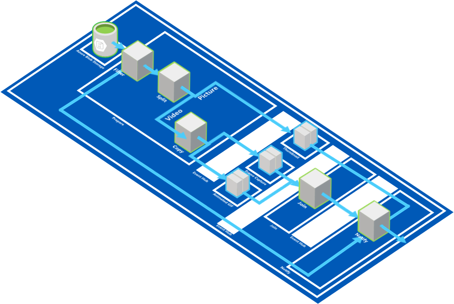
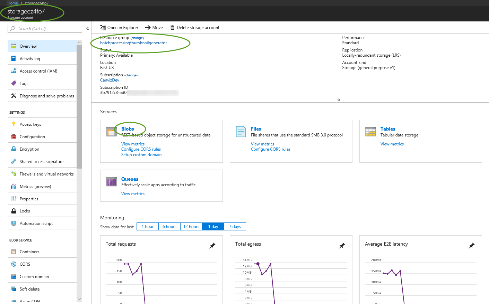
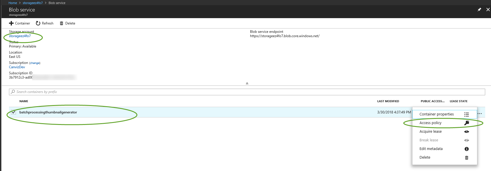
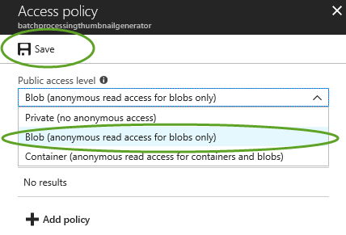
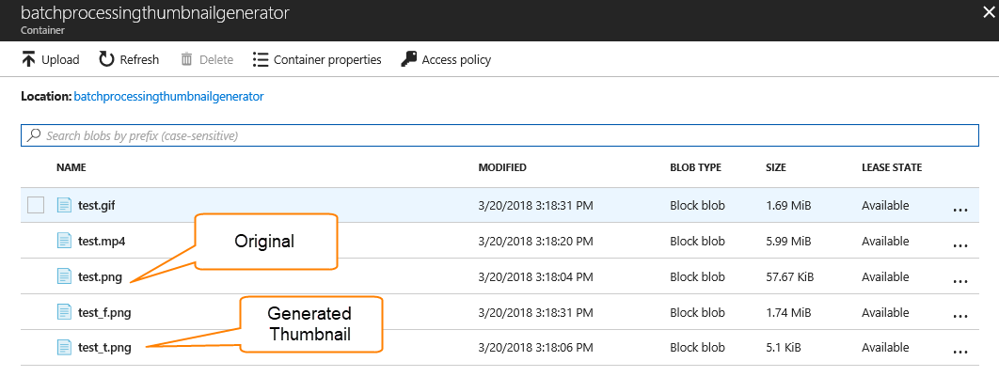
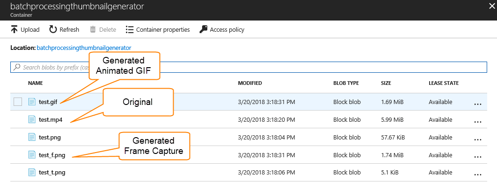
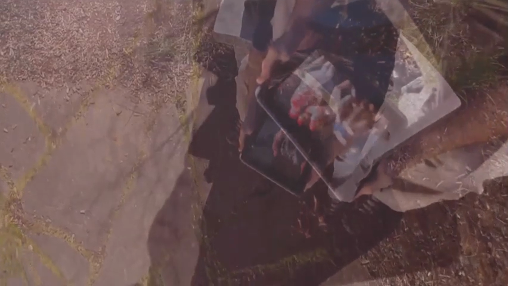
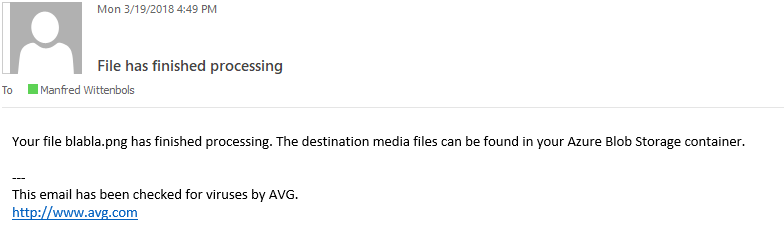

# Batch Computation Pattern #
## Deploying an Event-Driven Containerized Batch Processing Thumbnail Generator using Kubernetes on Azure Container Services (AKS) ##

In this sample you will use the Copier, Filter, Splitter and Join patterns to implement a thumbnail generator that will take a:
- Video, and creates a frame capture and an animated GIF.
- Picture, and creates a thumbnail.

Then it will notify a user of the successful completion of all the created assets by sending the user an e-mail.

**Filter**

You will implement the Filter pattern to filter out any unknown media types.

**Splitter**

You will implement the Splitter pattern to divide the work queues into two queues, one for videos and one for pictures.

**Copier**

You will implemented the Copier pattern to divide the video processing into two queues:
- To create a still frame capture
- To create an animated GIF

**Join**

You will then implement the Join pattern to combined all the output of the video work queues before notifying the user of its completion.

You'll be using FFMPEG to generate thumbnails, frame captures and animated GIFs, and use the Copier pattern to create 3 worker queues (each of each output size), the Filter patterns to exclude unsupported media that are too small to generate some big size thumbs and the Splitter patterns to split between video-processing and image-processing worker queues.

> **Note:** [FFMPEG](https://www.ffmpeg.org/ "FFMPEG") is an open source community-driven multimedia library to decode, encode, transcode, stream and play any media format. It is available as command line tool, as well as a [Docker image](https://hub.docker.com/r/jrottenberg/ffmpeg/ "FFMPEG Docker Image") which you will be using in this lab.



## Prerequisites

- An active [Microsoft Azure](https://azure.microsoft.com/en-us/free "Microsoft Azure") Subscription
- [Azure CLI](https://docs.microsoft.com/en-us/cli/azure/overview?view=azure-cli-latest "Azure CLI") installed
- [Curl](https://curl.haxx.se/download.html "Curl") command line tool installed (for downloading ```kubectl``` as well as testing samples in this lab)
- [Kubernetes CLI (kubectl)](https://kubernetes.io/docs/tasks/tools/install-kubectl/ "Kubernetes CLI (kubectl)") installed
- [Docker CLI](https://docs.docker.com/install/ "Docker CLI") installed
- An active [Docker account](https://id.docker.com/login "Docker account") (you will need to log on to push Docker images to your private repo)
- A new **Resource Group** and **Container Service (AKS)** created in the [Microsoft Azure Portal](https://portal.azure.com "Microsoft Azure Portal") to run samples in.
- Pvk2Pfx.exe Windows 10 SDK command line tool: [Pvk2Pfx.exe](https://docs.microsoft.com/en-us/windows-hardware/drivers/devtest/pvk2pfx)
- Open a standard Windows Command Prompt window (with an active PATH environment variable pointing to Azure CLI, Kubernetes CLI and Docker CLI)

- Although not required, we encourage you to read the book *Designing Distributed Systems* by Brendan Burns as the samples in this lab are written with the reader of this book in mind: [https://azure.microsoft.com/en-us/resources/designing-distributed-systems/en-us/](https://azure.microsoft.com/en-us/resources/designing-distributed-systems/en-us/ "Designing Distributed Systems")

## 1. First time set up ##

If you never used Azure CLI or Kubernetes CLI before or have used it but for a different subscription, you need to link your Azure subscription to the local Kubernetes configuration.

### 1.1 **Kubernetes CLI Local Configuration**

If you are using the Kubernetes CLI on a windows machine, it expects a ```config``` file in this folder location:

````html
%USERPROFILE%\.kube
````

For instance, if your user name is TestUser, you may find the kubectl ```config``` file in ```C:\Users\TestUser\.kube```

**Optionally:** If your Kubernetes configuration file is located elsewhere, in order for the Kubernetes CLI (kubectl) to find your configuration, you need to add the above path (including the 'config' file name) to the ```KUBECONFIG``` environment variable in a Command Prompt window, as such:

    SET KUBECONFIG=c:\pathtokubeconfig\config

### 1.2 **Logging into Azure from the Command Line**
In order for the ```kubectl``` statements below to be fired against the correct Azure Kubernetes (AKS) instance, you need to link your Azure subscription to the local Kubernetes configuration.

First you need to sign in,  by entering the following command in a Command Prompt window:


    az login

This will result in the following output:

    To sign in, use a web browser to open the page https://aka.ms/devicelogin and enter the code B9R2CY8ZP to authenticate.

Now, you need to open a browser and go to ```https://aka.ms/devicelogin``` and type in the code as returned from the ```az login``` command: ```B9R2CY8ZP```


This will authenticate your device again Azure and a response similar to this should appear in your Command Prompt window:

    [
      {
        "cloudName": "AzureCloud",
        "id": "3b7912c3-ad06-426e-8627-419123727111",
        "isDefault": true,
        "name": "CanvizDev",
        "state": "Enabled",
        "tenantId": "3dad2b09-9e66-4eb8-9bef-9f44544b0222",
        "user": {
          "name": "testuser@canviz.com",
          "type": "user"
        }
      }
    ]

> **Note:** Please take not of the **id** value above, that is your **subscriptionId** and you need it later in this lab.

### 1.3 **Linking your Azure subscription**

Next, you need to link your Azure subscription so that the Azure CLI (```az```) will work against your environment.

    az account set --subscription "3b7912c3-ad06-426e-8627-419123727111" 

### 1.4 **Getting Kubernetes configuration from Azure**

If you haven't already created a Resource Group for this lab, you can do so now with the following command:

    az group create --name batchprocessingthumbnailgenerator --location "eastus"

And if you haven't already create an AKS cluster, you can do so now with the following command:

	az aks create --name batchprocessingthumbnailgenerator --resource-group batchprocessingthumbnailgenerator --location "eastus" –-node-count 1 --generate-ssh-keys

> **Note:** This process may take a few minutes to complete.

Then, to make sure you can use **Azure Container Service (AKS)** as our context for when running ```kubectl``` commands, you need to enter the following command:

    az aks get-credentials --resource-group batchprocessingthumbnailgenerator --name batchprocessingthumbnailgenerator

where ```batchprocessingthumbnailgenerator``` is the name of a **Resource Group** you have created for yourself in the Azure Portal and ```batchprocessingthumbnailgenerator``` is the name of the **Managed Container Service** (AKS, not ACS!) you created in the Azure Portal. 

If successful, this will result in the following output:

    Merged "batchprocessingthumbnailgenerator" as current context in C:\Users\TestUser\.kube\config

**Optionally: Set the context, if you have used other Kubernetes clusters before**

If you have been developing against a local or a different Kubernetes cluster, your current ```kubectl``` configuration may point to a different cluster. To correct this, please use the following command:

    kubectl config set-context batchprocessingthumbnailgenerator

### 1.5 **Verify the correct Kubernetes cluster**

In order to verify that you are indeed talking to the correct Kubernetes cluster, you can use the following command:

    kubectl cluster-info

The output of this command should look similar to this:

    Kubernetes master is running at https://batchprocessingthumbnailgenerator-77a9ac84.hcp.eastus.azmk8s.io:443
    Heapster is running at https://batchprocessingthumbnailgenerator-77a9ac84.hcp.eastus.azmk8s.io:443/api/v1/namespaces/kube-system/services/heapster/proxy
    KubeDNS is running at https://batchprocessingthumbnailgenerator-77a9ac84.hcp.eastus.azmk8s.io:443/api/v1/namespaces/kube-system/services/kube-dns:dns/proxy
    kubernetes-dashboard is running at https://batchprocessingthumbnailgenerator-77a9ac84.hcp.eastus.azmk8s.io:443/api/v1/namespaces/kube-system/services/kubernetes-dashboard/proxy

If the URLs in the output point to localhost, please use ```kubectl config set-context``` command to change the context to the correct cluster.

### 1.6 **Create a Container Registry**

In order for you to storage private Docker container images later on in this lab, you will need to create a Azure Container Registry in your Azure account first.

But to group all the examples in this lab together, you will be creating a Resource Group for this lab first (f you haven't already done so) called ```batchprocessingthumbnailgenerator```:

    az group create --name batchprocessingthumbnailgenerator --location "eastus"

Then you will create the actual Azure Container Registry, which we will call ```batchprocessingthumbnailgeneratorregistry``:

    az acr create --name batchprocessingthumbnailgeneratorregistry --sku Basic --location eastus --admin-enabled --resource-group batchprocessingthumbnailgenerator

This will result in an output similar to this:

    {
      "adminUserEnabled": true,
      "creationDate": "2018-03-02T19:55:15.184411+00:00",
      "id": "/subscriptions/3b7912c3-ad06-426e-8627-419123721111/resourceGroups/batchprocessingthumbnailgenerator/providers/Microsoft.ContainerRegistry/registries/batchprocessingthumbnailgeneratorregistry",
      "location": "eastus",
      "loginServer": "batchprocessingthumbnailgeneratorregistry.azurecr.io",
      "name": "batchprocessingthumbnailgeneratorregistry",
      "provisioningState": "Succeeded",
      "resourceGroup": "batchprocessingthumbnailgenerator",
      "sku": {
    "name": "Basic",
    "tier": "Basic"
      },
      "status": null,
      "storageAccount": null,
      "tags": {},
      "type": "Microsoft.ContainerRegistry/registries"
    }

> **Note:** You will need to take note of your Azure subscription ID above (3b7912c3-ad06-426e-8627-419123721111), you will need that in the following command:

Next, you will need to assign your Azure user as owner to the newly created Azure Container Registry:

    az ad sp create-for-rbac --scopes /subscriptions/paste_your_subscription_id_here/resourceGroups/batchprocessingthumbnailgenerator/providers/Microsoft.ContainerRegistry/registries/batchprocessingthumbnailgeneratorregistry --role Owner --password Test12345

So, for instance:

    az ad sp create-for-rbac --scopes /subscriptions/3b7912c3-ad06-426e-8627-419123721111/resourceGroups/batchprocessingthumbnailgenerator/providers/Microsoft.ContainerRegistry/registries/batchprocessingthumbnailgeneratorregistry --role Owner --password Test12345

That will result in an output similar to this:

    Retrying role assignment creation: 1/36
    {
      "appId": "c1d73d5d-7f01-4e4d-b621-32ebe014ebb5",
      "displayName": "azure-cli-2018-03-02-19-55-29",
      "name": "http://azure-cli-2018-03-02-19-55-29",
      "password": "Test12345",
      "tenant": "3dad2b09-9e66-4eb8-9bef-9f44544b0e74"
    }

> **Note:** Please take note of the values for **appId** and **password** above, you will need those in the next step, when you will be creating a 
> 
>  in Kubernetes and log in into Docker to link the two together. 

### 1.7. **Create in a Secret in Kubernetes**

Now you will create a Secret in Kubernetes that will allow you to start pushing your own private Docker images into AKS:

    kubectl create secret docker-registry batchprocessingthumbnailgeneratorregistry.azurecr.io --docker-server=batchprocessingthumbnailgeneratorregistry.azurecr.io --docker-username=c1d73d5d-7f01-4e4d-b621-32ebe014ebb5 --docker-password=Test12345 --docker-email=youremailaddress@yourdomain.com 

Please make sure you replace the parameter values for **docker-username**, **docker-password** with the **appId** and **password** from the previous command and replace **docker-email** with your Docker e-mail, before running the command above.

### 1.8. **Login into Docker**

Finally, you will need to log in to Docker, so you can start building and pushing your own Docker images:

    docker login batchprocessingthumbnailgeneratorregistry.azurecr.io

It will ask you for your a user name and password. Please use the **appId** from the previous command as user name and the **password** from the previous command as the password. So, for instance: 

    Username: c1d73d5d-7f01-4e4d-b621-32ebe014ebb5
    Password: Test12345

## 2. Deploying the Batch Processing Thumbnail Generator into Azure

To implement the batch processing thumbnail generator, you will need the following "ingredients":

- An Azure Blob storage
  - to store the original files
  - to store the frame capture pictures
  - to store the animated GIFs
  - to store the thumbnails
  -  pictures
- 6 Kubernetes pods
  - 1 pod to prepare, filter and split the work items
  - 1 pod to process the Frame Capture work items
  - 1 pod to process the Animated GIF work items
  - 1 pod to process the Thumbnail work items
  - 1 pod to join the work items together
  - 1 pod notify the user

### 2.1. Azure Blob ARM Template

To make it easy for you, we provided an ARM template called ```azuredeploy.json``` that you can download to quickly setup the Azure Blob storage under your Azure account, as well as the necessary Event Hubs and Resource Groups. This ARM template excludes the deployment of the Docker images to Kubernetes Pods as listed below. You will have to do that manually as explained in the next paragraphs.

Execute the following command to create a Resource Group for this lab and deploy the ARM template:

    az group create --name batchprocessingthumbnailgenerator --location "eastus"
    az group deployment create --resource-group batchprocessingthumbnailgenerator --template-file azuredeploy.json

This may ask you for a namespaceName, for which you can use ```batchprocessingthumbnailgenerator```:

    Please provide string value for 'namespaceName' (? for help): batchprocessingthumbnailgenerator

It may take a few minutes to finish the deployment. When the deployment is finished, your Azure Storage resource exists in the created resource group ```batchprocessingthumbnailgenerator```

The output returns the following strings, which you will need to enter in several ```xyz-container.yaml``` files of the containers you are about to deploy:

    connectionStrings.eventHub
    
    connectionStrings.storageAccount

### 2.2. Enabling Public Read Access to your Azure Blob Storage

In order for the FFMPEG container (that you will create manually later on in this lab) to access uploaded media files in your Azure Blob Storage, you need to manually **change the access policy** of the generated Azure Blob storage account in the previous step:

Go the Azure Portal and navigate to the recently created storage account in the ```batchprocessingthumbnailgenerator``` resource group and click **Blobs**.



Then click on the 3 dots (...) right of the ```batchprocessingthumbnailgenerator``` blob container:



Then select the option **Blob (anonymous read access for blobs only)** from the drop-down list and click **Save**.



Now your Azure Blob Storage can be accessed by the FFMPEG container directly through a URL.

> **Note:** By default Azure Storage containers are private and the ```azuredeploy.json``` template does not contain any access policy. If no generated thumbnails, animated GIFs or frame capture pictures will appear in your Azure Blob Storage after running the batchprocessing thumbnail generator, it may be because of failure to execute this script.

## 3. Firing up the Pods

We will be creating several Docker images:

1. **PrepareContainer**, that will implement the **Filter**, **Split**, and **Copy** patterns.
2. **ThumbnailContainer**, that will generate a thumbnail for an incoming **Picture** blob, using **FFMPEG**.
3. **FrameCaptureContainer**, that will generate a single frame capture of an incoming **Video** blob, using **FFMPEG**.
4. **AnimatedGIFContainer**, that will generate a animated GIF of an incoming **Video** blob, using **FFMPEG**.
5. **JoinContainer**, that will join the output of the **FrameCaptureContainer** and **AnimatedGIFContainer**.
6. **NotifyContainer**, that will notify the user the media assets are generated.

Please navigate to the ```PrepareContainer``` folder.

### 3.1. Creating the PrepareContainer

### 3.1.1. Configure the PrepareContainer

Please edit the ```prepare-deployment.yaml``` file and change:
- the ```EVENT_HUB_CONNECTION_STRING``` value to match the Connection String of the ```batchprocessingthumbnailgenerator``` Event Hub created with the ARM template ```azuredeploy.json```.
- the ```STORAGE_ACCOUNT_CONNECTION_STRING``` value to match the Connection String of the Azure Blob storage created with the ARM template ```azuredeploy.json```.

#### 3.1.2. Build Docker Image

In the ```PrepareContainer``` folder, you will see a file called ```Dockerfile```: 
    
    FROM node:carbon
    
    # Create app directory
    WORKDIR /usr/src/app
    
    # Install app dependencies
    # A wildcard is used to ensure both package.json AND package-lock.json are copied
    # where available (npm@5+)
    COPY package*.json ./
    
    RUN npm install
    # If you are building your code for production
    # RUN npm install --only=production
    
    # Bundle app source
    COPY . .
    
    EXPOSE 8080
    CMD [ "npm", "start" ]

This file is needed to build a Docker image  from the source code in that folder. All the dependencies on external libraries, such as Node Express, Azure Storage, etc. are listed in the ```package.json``` file:

	{
	  "name": "prepare",
	  "version": "1.0.0",
	  "description": "Node.js on Docker",
	  "author": "Manfred Wittenbols <manfredw@canviz.com>",
	  "main": "server.js",
	  "scripts": {
	    "start": "node server.js"
	  },
	  "dependencies": {
	    "express": "^4.16.1",
	    "azure-storage": "^2.8.0",
	    "uuid": "^3.2.1",
	    "streamifier": "^0.1.1",
	    "multiparty": "^4.1.3",
	    "azure-event-hubs": "^0.0.8"
	  }
	}

By executing the following command you are telling Docker to build an image and tag it with a name so you can refer to it later from your Kubernetes implementation:
    
    docker build . -t batchprocessingthumbnailgeneratorregistry.azurecr.io/batchprocessing-prepare  

This should result in an output similar to this:

    Sending build context to Docker daemon  12.29kB
    Step 1/7 : FROM node:carbon
     ---> 672002a50a0b
    Step 2/7 : WORKDIR /usr/src/app
    Removing intermediate container d49017b79f70
     ---> 5c9f6fa92d07
    Step 3/7 : COPY package*.json ./
     ---> 4b3ba664d3aa
    Step 4/7 : RUN npm install
     ---> Running in 2292d59b06e8
    npm notice created a lockfile as package-lock.json. You should commit this file.
    npm WARN prepare@1.0.0 No repository field.
    npm WARN prepare@1.0.0 No license field.
    
    added 118 packages in 2.651s
    Removing intermediate container 2292d59b06e8
     ---> c7e6f37075ba
    Step 5/7 : COPY . .
     ---> ca877e7f1d67
    Step 6/7 : EXPOSE 8080
     ---> Running in 8c2641e81f91
    Removing intermediate container 8c2641e81f91
     ---> 223e38986cf4
    Step 7/7 : CMD [ "npm", "start" ]
     ---> Running in 8f9fca225d28
    Removing intermediate container 8f9fca225d28
     ---> d17d2ecc7306
    Successfully built d17d2ecc7306
    Successfully tagged batchprocessingthumbnailgeneratorregistry.azurecr.io/batchprocessing-prepare:latest
    SECURITY WARNING: You are building a Docker image from Windows against a non-Windows Docker host. All files and directories added to build context will have '-rwxr-xr-x' permissions. It is recommended to double check and reset permissions for sensitive files and directories.

#### 3.1.3. Push Docker Image

Then you can push the newly created Docker image to your private Azure Container Registry, by executing the following command: 

    docker push batchprocessingthumbnailgeneratorregistry.azurecr.io/batchprocessing-prepare

This will result in an output similar to this:

    5fad4d747f7b: Pushed
    724bddd4e7bc: Pushed
    f3d4dcb21144: Pushed
    22c640a5986a: Pushed
    eb84ae861586: Pushed
    227d94b074c0: Pushed
    066828d986f0: Pushed
    daa6e91e491c: Pushed
    6b60013e5875: Pushed
    d6335a641f5e: Pushed
    5c33df241050: Pushed
    ffc4c11463ee: Pushed
    latest: digest: sha256:8b20bc0107fcc9d757fb8995609e94e8b73c52be76310ab314dbc3a9a7411cf0 size: 2840

Now, you have a Docker image in the Azure Container Registry that you can use as image in your Kubernetes implementation for this container.

#### 3.1.4. Create Kubernetes Deployment:

Now you have a private Docker image with tag ```batchprocessingthumbnailgeneratorregistry.azurecr.io/batchprocessing-prepare```, you can refer to that from the ```prepare-deployment.yaml``` file:

    apiVersion: extensions/v1beta1
    kind: Deployment
    metadata:
      name: prepare-deployment
    spec:
      replicas: 2
      template:
        metadata:
          labels:
            app: prepare-deployment
        spec:
          containers:
          - name: prepare-deployment
            image: batchprocessingthumbnailgeneratorregistry.azurecr.io/batchprocessing-prepare
            ports:
            - containerPort: 8080

Now, execute the following command to create the Kubernetes deployment:

    kubectl create -f prepare-deployment.yaml

#### 3.1.5. Exposes the Kubernetes Deployment:

In order to verify you have successfully deployed your Docker image in a Kubernetes pod, you need to expose the Deployment to the outside world:

    kubectl expose deployment prepare-deployment --port=8080 --type=LoadBalancer --name prepare-deployment

#### 3.1.6. Verify successful deployment of Prepare Container

To verify you have successfully deployed your Docker image to Kubernetes, execute the following command to wait for the External IP address to be assigned by Kubernetes to your container:

    kubectl get services --watch

This will result in an output like this:

    NAME                    TYPE           CLUSTER-IP    EXTERNAL-IP     PORT(S)          AGE
    prepare-deployment      LoadBalancer   10.0.50.96    <pending>       8080:30986/TCP   50m
    kubernetes              ClusterIP      10.0.0.1      <none>          443/TCP          13d

And after a few minutes, when the external IP address has been assigned:

    NAME                    TYPE           CLUSTER-IP    EXTERNAL-IP     PORT(S)          AGE
    prepare-deployment      LoadBalancer   10.0.50.96    13.89.189.227   8080:30986/TCP   50m
    kubernetes              ClusterIP      10.0.0.1      <none>          443/TCP          13d

Then, you can either use the External IP address to perform a cURL command to see the output or go straight into the pod, and perform a cURL command from inside the pod:

    curl http://13.89.189.227:8080/alive

which should return this:

    OK

or, if you do not want to wait for the external IP address to be populated, you can execute the following command:

    kubectl run curl-batchprocessingthumbnailgenerator --image=radial/busyboxplus:curl -i --tty --rm

which opens a bash inside the pod, like this:

    If you don't see a command prompt, try pressing enter.
    [ root@curl-batchprocessingthumbnailgenerator-7d46fdcd48-wfvsh:/ ]$ 

where you can execute a cURL command using the internal host name ```prepare-deployment``` (rather than the IP address) inside the pod:

    [ root@curl-batchprocessingthumbnailgenerator-7d46fdcd48-wfvsh:/ ]$ curl http://prepare-deployment:8080/alive
    OK[ root@curl-batchprocessingthumbnailgenerator-7d46fdcd48-wfvsh:/ ]$

> **Note:** note that we are calling the ```/alive``` path and it returns ```OK``` as expected, as this is one of the routes we implemented in ```server.js```:

    ...
    
    app.get('/alive', (req, res) => {
        res.status(200).send('OK');
    });
    
    ...

This confirms your Docker image is up and running inside Kubernetes and working as expected.

## 3.2. Creating the Thumbnail Container

In similar fashion to the Prepare Container, you will be deploying the Thumbnail Container by:
- Building the Docker image
- Pushing the Docker image to your repo
- Creating the Kubernetes Deployment
- Exposing the Kubernetes Deployment

Please navigate to the ```ThumbnailContainer``` folder to deploy the next container.

### 3.2.1. Configure the Thumbnail Container

Please edit the ```thumbnail-deployment.yaml``` file and change:
- the ```STORAGE_ACCOUNT_CONNECTION_STRING``` value to match the Connection String of the ```batchprocessingthumbnailgenerator``` Event Hub created with the ARM template ```azuredeploy.json```.
- the ```STORAGE_ACCOUNT_CONNECTION_STRING``` value to match the Connection String of the Azure Blob storage created with the ARM template ```azuredeploy.json```.

### 3.2.2. Deploy the Thumbnail Container

First you need to build the corresponding Docker image:

    docker build . -t batchprocessingthumbnailgeneratorregistry.azurecr.io/batchprocessing-thumbnail

Then you need to push that Docker image to Docker:

    docker push batchprocessingthumbnailgeneratorregistry.azurecr.io/batchprocessing-thumbnail 

Then you need to deploy the Kubernetes container based on the Docker image above:

    kubectl create -f thumbnail-deployment.yaml

Finally, you need to expose the deployment with the following command:

    kubectl expose deployment thumbnail-deployment --port=8081 --type=LoadBalancer --name thumbnail-deployment

Then you can either go inside the pod as explained previously, or wait until Kubernetes issued an EXTERNAL-IP address and perform this command, which after a few minutes will populate an EXTERNAL-IP address for the ```thumbnail-deployment```:

    kubectl get services --watch

After the EXTERNAL-IP address is issued, you will be able to verify the successful deployment by executing the following cURL command, after replacing the IP address with yours:

    curl http://13.89.189.123:8081/alive

Which should result in: 

    OK

## 3.3. Creating the FrameCapture Container

In similar fashion to the previous containers, you will be deploying the FrameCapture Container by:
- Building the Docker image
- Pushing the Docker image to your repo
- Creating the Kubernetes Deployment
- Exposing the Kubernetes Deployment

Please navigate to the ```FrameCaptureContainer``` folder to deploy the next container.

### 3.3.1. Configure the FrameCapture Container

Please edit the ```framecapture-deployment.yaml``` file and change:
- the ```EVENT_HUB_CONNECTION_STRING``` value to match the Connection String of the ```batchprocessingthumbnailgenerator``` Event Hub created with the ARM template ```azuredeploy.json```. 
- the ```STORAGE_ACCOUNT_CONNECTION_STRING``` value to match the Connection String of the Azure Blob storage created with the ARM template ```azuredeploy.json```.

### 3.3.2. Deploy the FrameCapture Container

First you need to build the corresponding Docker image:

    docker build . -t batchprocessingthumbnailgeneratorregistry.azurecr.io/batchprocessing-framecapture

Then you need to push that Docker image to Docker:

    docker push batchprocessingthumbnailgeneratorregistry.azurecr.io/batchprocessing-framecapture 

Then you need to deploy the Kubernetes container based on the Docker image above:

    kubectl create -f framecapture-deployment.yaml

Finally, you need to expose the deployment with the following command:

    kubectl expose deployment framecapture-deployment --port=8082 --type=LoadBalancer --name framecapture-deployment

Then you can either go inside the pod as explained previously, or wait until Kubernetes issued an EXTERNAL-IP address and perform this command, which after a few minutes will populate an EXTERNAL-IP address for the ```framecapture-deployment```:

    kubectl get services --watch

After the EXTERNAL-IP address is issued, you will be able to verify the successful deployment by executing the following cURL command, after replacing the IP address with yours:

    curl http://13.89.189.124:8082/alive

Which should result in: 

    OK

## 3.4. Creating the AnimatedGIF Container

In similar fashion to the previous containers, you will be deploying the AnimatedGIF Container by:
- Building the Docker image
- Pushing the Docker image to your repo
- Creating the Kubernetes Deployment
- Exposing the Kubernetes Deployment

Please navigate to the ```AnimatedGIFContainer``` folder to deploy the next container.

### 3.4.1. Configure the AnimatedGIF Container

Please edit the ```animatedgif-deployment.yaml``` file and change:
- the ```EVENT_HUB_CONNECTION_STRING``` value to match the Connection String of the ```batchprocessingthumbnailgenerator``` Event Hub created with the ARM template ```azuredeploy.json```. 
- the ```STORAGE_ACCOUNT_CONNECTION_STRING``` value to match the Connection String of the Azure Blob storage created with the ARM template ```azuredeploy.json```.

### 3.4.2. Deploy the AnimatedGIF Container

First you need to build the corresponding Docker image:

    docker build . -t batchprocessingthumbnailgeneratorregistry.azurecr.io/batchprocessing-animatedgif

Then you need to push that Docker image to Docker:

    docker push batchprocessingthumbnailgeneratorregistry.azurecr.io/batchprocessing-animatedgif 

Then you need to deploy the Kubernetes container based on the Docker image above:

    kubectl create -f animatedgif-deployment.yaml

Finally, you need to expose the deployment with the following command:

    kubectl expose deployment animatedgif-deployment --port=8083 --type=LoadBalancer --name animatedgif-deployment

Then you can either go inside the pod as explained previously, or wait until Kubernetes issued an EXTERNAL-IP address and perform this command, which after a few minutes will populate an EXTERNAL-IP address for the ```animatedgif-deployment```:

    kubectl get services --watch

After the EXTERNAL-IP address is issued, you will be able to verify the successful deployment by executing the following cURL command, after replacing the IP address with yours:

    curl http://13.89.189.125:8083/alive

Which should result in: 

    OK

## 3.5. Creating the Join Container

In similar fashion to the previous containers, you will be deploying the Join Container by:
- Building the Docker image
- Pushing the Docker image to your repo
- Creating the Kubernetes Deployment
- Exposing the Kubernetes Deployment

Please navigate to the ```JoinContainer``` folder to deploy the next container.

### 3.5.1. Configure the Join Container

Please edit the ```join-deployment.yaml``` file and change the ```EVENT_HUB_CONNECTION_STRING``` value to match the Connection String of the ```batchprocessingthumbnailgenerator``` Event Hub that was created after you ran the ARM template ```azuredeploy.json```.  

### 3.5.2. Deploy the Join Container

First you need to build the corresponding Docker image:

    docker build . -t batchprocessingthumbnailgeneratorregistry.azurecr.io/batchprocessing-join

Then you need to push that Docker image to Docker:

    docker push batchprocessingthumbnailgeneratorregistry.azurecr.io/batchprocessing-join 

Then you need to deploy the Kubernetes container based on the Docker image above:

    kubectl create -f join-deployment.yaml

Finally, you need to expose the deployment with the following command:

    kubectl expose deployment join-deployment --port=8084 --type=LoadBalancer --name join-deployment

Then you can either go inside the pod as explained previously, or wait until Kubernetes issued an EXTERNAL-IP address and perform this command, which after a few minutes will populate an EXTERNAL-IP address for the ```join-deployment```:

    kubectl get services --watch

After the EXTERNAL-IP address is issued, you will be able to verify the successful deployment by executing the following cURL command, after replacing the IP address with yours:

    curl http://13.89.189.125:8084/alive

Which should result in: 

    OK

## 3.6. Creating the Notify Container

Please navigate to the ```NotifyContainer``` folder to deploy the next container.

### 3.6.1. Configure the Notify Container

Please edit the ```notify-deployment.yaml``` file and change:
- the ```EVENT_HUB_CONNECTION_STRING``` value to match the Connection String of the ```batchprocessingthumbnailgenerator``` Event Hub that was created after you ran the ARM template ```azuredeploy.json```, and
Edit the ```local.settings.json``` file inside the container and change:
- the ```mailConfig``` to match the SMTP server credentials of your choice.

> **Note: ** Please refer to the **NodeMailer documentation** to better understand the e-mail configuration: [https://nodemailer.com/smtp/](https://nodemailer.com/smtp/ "NodeMailer SMTP Configuration")

### 3.6.2. Deploy the Notify Container

First you need to build the corresponding Docker image:

    docker build . -t batchprocessingthumbnailgeneratorregistry.azurecr.io/batchprocessing-notify

Then you need to push that Docker image to Docker:

    docker push batchprocessingthumbnailgeneratorregistry.azurecr.io/batchprocessing-notify 

Then you need to deploy the Kubernetes container based on the Docker image above:

    kubectl create -f notify-deployment.yaml

Finally, you need to expose the deployment with the following command:

    kubectl expose deployment notify-deployment --port=8085 --type=LoadBalancer --name notify-deployment

Then you can either go inside the pod as explained previously, or wait until Kubernetes issued an EXTERNAL-IP address and perform this command, which after a few minutes will populate an EXTERNAL-IP address for the ```notify-deployment```:

    kubectl get services --watch

After the EXTERNAL-IP address is issued, you will be able to verify the successful deployment by executing the following cURL command, after replacing the IP address with yours:

    curl http://13.89.189.126:8085/alive

Which should result in: 

    OK

## 4. Testing your Event-Driven Containerized Batch Processing Thumbnail Generator

### 4.1. Verify all pods are running 

By now, you should have 5 pods running, which you can verify by executing the following command:

    kubectl get pods --output=wide

This will result in an output similar to this:

    NAME                                       READY     STATUS    RESTARTS   AGE
    animatedgif-deployment-3667050956-sv5c5    1/1       Running   0          22m       10.244.1.31   aks-nodepool1-56759493-2
    framecapture-deployment-3422155969-1m9mt   1/1       Running   0          22m       10.244.1.30   aks-nodepool1-56759493-2
    join-deployment-628260341-6019f            1/1       Running   0          22m       10.244.0.10   aks-nodepool1-56759493-1
    join-deployment-628260341-kttm8            1/1       Running   0          22m       10.244.1.32   aks-nodepool1-56759493-2
    notify-deployment-800979295-h8dv9          1/1       Running   0          21m       10.244.1.33   aks-nodepool1-56759493-2
    notify-deployment-800979295-lz9lw          1/1       Running   0          21m       10.244.2.18   aks-nodepool1-56759493-0
    prepare-deployment-1110915010-8tgqz        1/1       Running   0          25m       10.244.1.29   aks-nodepool1-56759493-2
    thumbnail-deployment-1391653075-t3nh0      1/1       Running   0          23m       10.244.2.17   aks-nodepool1-56759493-0

Now, to test the complete deployment, all we have to do now is send a picture or a video the to PrepareContainer's external endpoint. To determine the EXTERNAL-IP address of the containers, execute the following command:

    kubectl get services

This should result in an output similar to this:

    NAME                      TYPE           CLUSTER-IP     EXTERNAL-IP     PORT(S)          AGE
    animatedgif-deployment    LoadBalancer   10.0.229.148   52.170.92.127   8083:32033/TCP   21m
    framecapture-deployment   LoadBalancer   10.0.213.134   13.90.226.183   8082:31910/TCP   21m
    join-deployment           LoadBalancer   10.0.211.187   13.90.86.177    8084:30024/TCP   21m
    kubernetes                ClusterIP      10.0.0.1       <none>          443/TCP          4d
    notify-deployment         LoadBalancer   10.0.206.58    13.90.86.176    8085:32566/TCP   20m
    prepare-deployment        LoadBalancer   10.0.180.170   13.90.86.175    8080:32100/TCP   23m
    thumbnail-deployment      LoadBalancer   10.0.158.212   13.90.231.17    8081:32629/TCP   22m

### 4.2. Submit a picture as input  

First, navigate to the ```PrepareContainer``` folder. 

According to the output above we can access the prepare-container by executing the following cURL statement from the ```PrepareContainer``` folder, to see if it is alive and working properly. Please replace ```youremail@somedomain.com``` with your e-mail address to receive e-mail notifications.

    curl -H "Content-Type: multipart/form-data" -F "data=@test.png" "http://13.90.86.175:8080/prepare?email=youremail@somedomain.com"

> **Note:** test.png refers to a test image we placed inside the ```PrepareContainer``` folder for your convenience. 


Which should result in two files in your Azure Blob storage:



**Expected Thumbnail Output** ```test_t.png```:


### 4.3. Submit a video as input

First, navigate to the ```PrepareContainer``` folder.

And if we supply a video file as input:

    curl -H "Content-Type: multipart/form-data" -F "data=@test.mp4" "http://13.90.86.175:8080/prepare?email=youremail@somedomain.com"

This should result in three files in your Azure Blob storage:



**Expected Frame Capture Output** ```test_f.png```:



**Expected Animated GIF Output** ```test.gif```:


### 4.4. E-mail notification

Also, after successful completion you should have received an e-mail notification (if you setup a valid SMTP server configuration in the NotifyContainer):




> **Note: **If your output files were generated successfully and you can see them in your Azure Blob Storage, and you have set up your SMTP configuration correctly in the NotifyContainer, but you are not receiving any notification e-mails, it may be that you are not allowed to perform SMTP requests from your Azure environment.

You can check any SMTP issues by executing the following command (where the pod identifier matches the output of the ```kubecetl get pods``` command):

    kubectl logs notify-deployment-800979295-6k7fk

A potential error message may look like this:

    Message failed: 550 5.7.60 SMTP; Client does not have permissions to send as this sender [CY4PR08MB2887.namprd08.prod.outlook.com]

You may have to deploy an alternative **Kubernetes Pod Security Policy**. Or, alternatively you can run the NotifyContainer locally to confirm receiving the e-mail notifications.

## 5. Conclusion

In this lab you created an event-driven batch processing thumbnail generator by firing up several replicated Docker containers that are linked together using Event Hubs. 

You implemented a Filter, Splitter, Copier and Join pattern to route events to the right containers.

## 6. Summary

These are the statements you executed to deploy all the containers (but now from within the parent folder for your convenience). 
    
    az aks create --name batchprocessingthumbnailgenerator --resource-group batchprocessingthumbnailgenerator --location "eastus" –-node-count 1 --generate-ssh-keys
    
    kubectl config set-context batchprocessingthumbnailgenerator
    kubectl cluster-info
    
    az acr create --name batchprocessingthumbnailgeneratorregistry --sku Basic --location eastus --admin-enabled --resource-group batchprocessingthumbnailgenerator
    
    az ad sp create-for-rbac --scopes /subscriptions/paste_your_subscription_id_here/resourceGroups/batchprocessingthumbnailgenerator/providers/Microsoft.ContainerRegistry/registries/batchprocessingthumbnailgeneratorregistry --role Owner --password Test12345
    
    kubectl create secret docker-registry batchprocessingthumbnailgeneratorregistry.azurecr.io --docker-server=batchprocessingthumbnailgeneratorregistry.azurecr.io --docker-username=c1d73d5d-7f01-4e4d-b621-32ebe014ebb5 --docker-password=Test12345 --docker-email=youremailaddress@yourdomain.com 
    
    docker login batchprocessingthumbnailgeneratorregistry.azurecr.io
    
    docker build ./PrepareContainer -t batchprocessingthumbnailgeneratorregistry.azurecr.io/batchprocessing-prepare
    docker push batchprocessingthumbnailgeneratorregistry.azurecr.io/batchprocessing-prepare
    
    kubectl create -f ./PrepareContainer/prepare-deployment.yaml
    kubectl expose deployment prepare-deployment --port=8080 --type=LoadBalancer --name prepare-deployment
    
    docker build ./ThumbnailContainer -t batchprocessingthumbnailgeneratorregistry.azurecr.io/batchprocessing-thumbnail
    docker push batchprocessingthumbnailgeneratorregistry.azurecr.io/batchprocessing-thumbnail 
    
    kubectl create -f ./ThumbnailContainer/thumbnail-deployment.yaml
    kubectl expose deployment thumbnail-deployment --port=8081 --type=LoadBalancer --name thumbnail-deployment
    
    docker build ./FrameCaptureContainer -t batchprocessingthumbnailgeneratorregistry.azurecr.io/batchprocessing-framecapture
    docker push batchprocessingthumbnailgeneratorregistry.azurecr.io/batchprocessing-framecapture
    
    kubectl create -f ./FrameCaptureContainer/framecapture-deployment.yaml
    kubectl expose deployment framecapture-deployment --port=8082 --type=LoadBalancer --name framecapture-deployment
    
    docker build ./AnimatedGIFContainer -t batchprocessingthumbnailgeneratorregistry.azurecr.io/batchprocessing-animatedgif
    docker push batchprocessingthumbnailgeneratorregistry.azurecr.io/batchprocessing-animatedgif
    
    kubectl create -f ./AnimatedGIFContainer/animatedgif-deployment.yaml
    kubectl expose deployment animatedgif-deployment --port=8083 --type=LoadBalancer --name animatedgif-deployment
    
    docker build ./JoinContainer -t batchprocessingthumbnailgeneratorregistry.azurecr.io/batchprocessing-join
    docker push batchprocessingthumbnailgeneratorregistry.azurecr.io/batchprocessing-join
    
    kubectl create -f ./JoinContainer/join-deployment.yaml
    kubectl expose deployment join-deployment --port=8084 --type=LoadBalancer --name join-deployment
    
    docker build ./NotifyContainer -t batchprocessingthumbnailgeneratorregistry.azurecr.io/batchprocessing-notify
    docker push batchprocessingthumbnailgeneratorregistry.azurecr.io/batchprocessing-notify
    
    kubectl create -f ./NotifyContainer/notify-deployment.yaml
    kubectl expose deployment notify-deployment --port=8085 --type=LoadBalancer --name notify-deployment
    
    kubectl get pods --output=wide
    kubectl get services
    kubectl get services --watch

These are the statements to tear-down all the containers, so you can re-build all the containers all over again with the statements above. 

    kubectl delete service prepare-deployment
    kubectl delete deployment prepare-deployment
    
    docker rmi batchprocessingthumbnailgeneratorregistry.azurecr.io/batchprocessing-prepare
    
    kubectl delete service thumbnail-deployment
    kubectl delete deployment thumbnail-deployment
    
    docker rmi batchprocessingthumbnailgeneratorregistry.azurecr.io/batchprocessing-thumbnail
    
    kubectl delete service framecapture-deployment
    kubectl delete deployment framecapture-deployment
    
    docker rmi batchprocessingthumbnailgeneratorregistry.azurecr.io/batchprocessing-framecapture
    
    kubectl delete service animatedgif-deployment
    kubectl delete deployment animatedgif-deployment
    
    docker rmi batchprocessingthumbnailgeneratorregistry.azurecr.io/batchprocessing-animatedgif
    
    kubectl delete service join-deployment
    kubectl delete deployment join-deployment
    
    docker rmi batchprocessingthumbnailgeneratorregistry.azurecr.io/batchprocessing-join
     
    kubectl delete service notify-deployment
    kubectl delete deployment notify-deployment
    
    docker rmi batchprocessingthumbnailgeneratorregistry.azurecr.io/batchprocessing-notify
    
    kubectl get pods --output=wide
    kubectl get services

## 7. Contributors ##
| Roles                                    			| Author(s)                                			|
| -------------------------------------------------	| ------------------------------------------------- |
| Project Lead / Architect / Lab Manuals		    | Manfred Wittenbols (Canviz) @mwittenbols          |
| Sponsor / Support                        			| Phil Evans (Microsoft)                            |
| Sponsor / Support                        			| Anand Chandramohan (Microsoft)                    |

## 8. Version history ##

| Version | Date          		| Comments        |
| ------- | ------------------- | --------------- |
| 1.1     | March 28, 2018 	    | Minor changes   |
| 1.0     | February 27, 2018 	| Initial release |

## Disclaimer ##
**THIS CODE IS PROVIDED *AS IS* WITHOUT WARRANTY OF ANY KIND, EITHER EXPRESS OR IMPLIED, INCLUDING ANY IMPLIED WARRANTIES OF FITNESS FOR A PARTICULAR PURPOSE, MERCHANTABILITY, OR NON-INFRINGEMENT.**

----------


**Azure Container Service (AKS)** 


